```
# Technical Specification

# 1. INTRODUCTION

## 1.1 Executive Summary

The MFE (MATLAB Financial Econometrics) Toolbox is a comprehensive suite of <span style="background-color: yellow">Python modules</span> designed for modeling financial time series and conducting advanced econometric analyses. <span style="background-color: yellow">While retaining its legacy version 4.0 identity, the toolbox has been completely re-implemented using Python 3.12, incorporating modern programming constructs such as async/await patterns and strict type hints</span>.

<span style="background-color: yellow">The toolbox leverages Python's scientific computing ecosystem, built upon foundational libraries including NumPy for matrix operations, SciPy for optimization and statistical functions, Pandas for time series handling, Statsmodels for econometric modeling, and Numba for performance optimization</span>. This robust framework addresses critical business needs in financial modeling, macroeconomic analysis, and cross-sectional data analysis.

The toolbox provides researchers, analysts, and practitioners with robust tools for:
- Financial time series modeling and forecasting
- Volatility and risk modeling using univariate and multivariate approaches  
- High-frequency financial data analysis
- Cross-sectional econometric analysis
- Bootstrap-based statistical inference
- Advanced distribution modeling and simulation

Key stakeholders include financial institutions, academic researchers, and quantitative analysts requiring production-grade econometric tools. The toolbox delivers significant value through its comprehensive coverage of modern econometric methods, high-performance implementations, and <span style="background-color: yellow">seamless integration with the Python ecosystem</span>.

## 1.2 System Overview

### Project Context
The MFE Toolbox positions itself as an enterprise-grade econometric analysis platform within <span style="background-color: yellow">Python's dynamic and extensible scientific computing ecosystem</span>. It extends <span style="background-color: yellow">Python's native capabilities by providing specialized routines for financial time series analysis, leveraging Numba's @jit decorators for performance-critical tasks. The system implements modern class-based models using dataclasses and strict type hints for robust type safety and enhanced maintainability</span>.

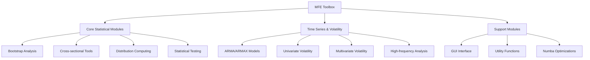

### High-Level Description

<span style="background-color: yellow">The system architecture follows a modern Python package structure organized into four main namespaces</span>:

1. Core Statistical Modules (`mfe.core`):
   - Bootstrap: Robust resampling for dependent time series
   - Cross-section: Regression and principal component analysis
   - Distributions: Advanced statistical distributions
   - Tests: Comprehensive statistical testing suite

2. Time Series & Volatility Modules (`mfe.models`):
   - Timeseries: ARMA/ARMAX modeling and diagnostics
   - Univariate: Single-asset volatility models (AGARCH, APARCH, etc.)
   - Multivariate: Multi-asset volatility models (BEKK, CCC, DCC)
   - Realized: High-frequency financial econometrics

3. Support Modules (`mfe.utils`, `mfe.ui`):
   - <span style="background-color: yellow">GUI: Interactive modeling environment built with PyQt6</span>
   - Utility: Data transformation and helper functions
   - <span style="background-color: yellow">Performance: Numba-optimized computational kernels</span>

### Success Criteria

Technical Success Metrics:
- <span style="background-color: yellow">Successful Numba JIT compilation across supported platforms</span>
- <span style="background-color: yellow">Proper initialization following Python packaging conventions</span>
- <span style="background-color: yellow">Seamless integration with NumPy, SciPy, and Statsmodels</span>
- Robust error handling and input validation

Performance Indicators:
- Computational efficiency in high-frequency analysis
- Numerical stability in optimization routines
- Memory efficiency in large dataset processing
- <span style="background-color: yellow">Response time in asynchronous operations</span>

## 1.3 Scope

### In-Scope Elements

Core Features:
- Financial time series modeling and forecasting
- Univariate and multivariate volatility modeling
- High-frequency data analysis and realized measures
- Cross-sectional regression and principal component analysis
- Bootstrap-based inference methods
- Advanced distribution modeling
- Statistical testing and diagnostics

Implementation Boundaries:
- <span style="background-color: yellow">Cross-platform Python 3.12 deployment environment</span>
- <span style="background-color: yellow">Numba-based optimizations for performance-critical computations</span>
- <span style="background-color: yellow">Integration with Python's scientific stack (NumPy, SciPy, Pandas, Statsmodels)</span>
- <span style="background-color: yellow">Support for both interactive usage (via PyQt6-based GUI) and programmatic API access</span>
- <span style="background-color: yellow">Structured package layout following modern Python conventions</span>

### Out-of-Scope Elements

- Real-time data feeds and market connectivity
- Portfolio optimization and asset allocation
- Option pricing and derivatives modeling
- Machine learning and neural network implementations
- Database integration and persistence
- Web-based interfaces and REST APIs
- <span style="background-color: yellow">Multi-language support beyond Python ecosystem</span>
- Cloud deployment and distributed computing

# 2. PRODUCT REQUIREMENTS

## 2.1 Feature Catalog

### Time Series Analysis Framework (F-001)
- **Category**: Core Analytics
- **Priority**: Critical
- **Status**: Completed

**Description**:  
A comprehensive ARMA/ARMAX modeling and forecasting framework that enables precise time series prediction and analysis. <span style="background-color: yellow">Provides robust model estimation and diagnostic tools built on SciPy's numerical optimization capabilities</span>.

**Dependencies**:
- <span style="background-color: yellow">Statsmodels for time series modeling</span>
- <span style="background-color: yellow">Numba-optimized core functions</span>
- <span style="background-color: yellow">NumPy for array operations</span>
- <span style="background-color: yellow">Pandas for time series handling</span>

### Volatility Modeling System (F-002)
- **Category**: Risk Analytics
- **Priority**: Critical
- **Status**: Completed

**Description**:  
Unified framework for univariate and multivariate volatility models supporting GARCH variants (AGARCH, EGARCH, FIGARCH) and multivariate specifications (BEKK, DCC). <span style="background-color: yellow">Delivers accurate risk assessment and volatility forecasting through flexible model selection powered by SciPy's optimization routines</span>.

**Dependencies**:
- <span style="background-color: yellow">SciPy optimization routines</span>
- <span style="background-color: yellow">Numba for performance optimization</span>
- <span style="background-color: yellow">NumPy for matrix operations</span>

### High-Frequency Analytics Suite (F-003)
- **Category**: Market Microstructure
- **Priority**: High
- **Status**: Completed

**Description**:  
Advanced realized volatility estimation and noise filtering system for intraday data analysis. <span style="background-color: yellow">Features SciPy-based kernel methods, Python-native price filtering, and robust estimation techniques for market microstructure noise</span>.

**Dependencies**:
- <span style="background-color: yellow">Pandas for time conversion and data handling</span>
- <span style="background-color: yellow">Python-based price filtering modules</span>
- <span style="background-color: yellow">SciPy for kernel-based estimation functions</span>

### Statistical Framework (F-004)
- **Category**: Core Statistics
- **Priority**: High
- **Status**: Completed

**Description**:  
Comprehensive statistical distribution and testing framework supporting advanced distributions (GED, Hansen's skewed T) and diagnostic tests. <span style="background-color: yellow">Enables robust statistical inference across all modeling components using Statsmodels and SciPy's statistical functions</span>.

**Dependencies**:
- <span style="background-color: yellow">Statsmodels for statistical modeling</span>
- <span style="background-color: yellow">SciPy for distribution functions and optimization</span>
- <span style="background-color: yellow">NumPy for numerical computations</span>

## 2.2 Functional Requirements

### Time Series Core Requirements

| Requirement ID | Description | Priority | Complexity |
|---------------|-------------|----------|------------|
| F-001-RQ-001 | **ARMA/ARMAX model estimation with robust parameter optimization using class-based Python modules** | Must-Have | High |
| F-001-RQ-002 | **Multi-step forecasting with error propagation using async/await patterns** | Must-Have | Medium |
| F-001-RQ-003 | **Comprehensive diagnostic tools and residual analysis implemented in Python's scientific stack** | Must-Have | Medium |
| F-001-RQ-004 | **Unit root testing and stationarity analysis using Statsmodels** | Should-Have | Low |

### Volatility Engine Requirements

| Requirement ID | Description | Priority | Complexity |
|---------------|-------------|----------|------------|
| F-002-RQ-001 | **Unified GARCH model suite with parameter constraints using Python classes** | Must-Have | High |
| F-002-RQ-002 | **Multivariate volatility estimation and forecasting with async support** | Must-Have | High |
| F-002-RQ-003 | **Robust likelihood optimization with Numba acceleration** | Must-Have | Medium |
| F-002-RQ-004 | **Monte Carlo simulation capabilities using NumPy's random number generators** | Should-Have | Medium |

### High-Frequency Analytics Requirements

| Requirement ID | Description | Priority | Complexity |
|---------------|-------------|----------|------------|
| F-003-RQ-001 | **Realized volatility estimation with noise filtering using Python's scientific stack** | Must-Have | High |
| F-003-RQ-002 | **Kernel-based covariance estimation with Numba optimization** | Must-Have | High |
| F-003-RQ-003 | **Time conversion and sampling schemes using Pandas** | Must-Have | Medium |
| F-003-RQ-004 | **Price filtering and data preprocessing with NumPy and Pandas** | Should-Have | Medium |

## 2.3 Feature Relationships

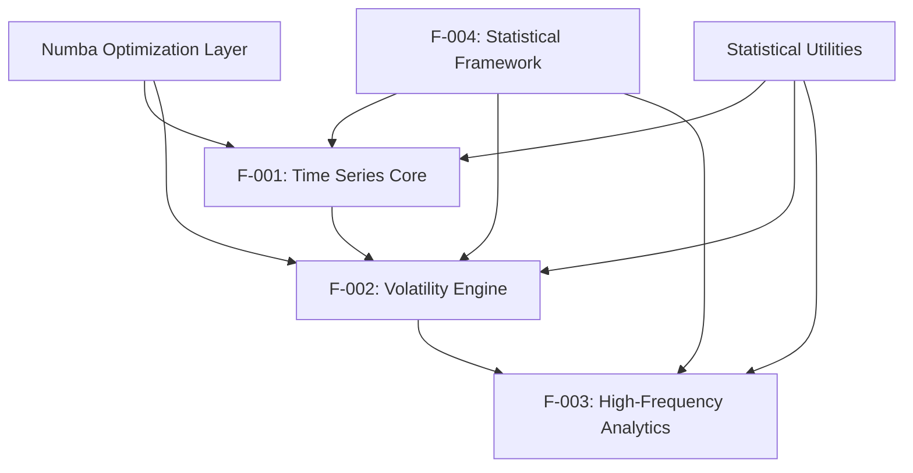

### Shared Components

- <span style="background-color: yellow">NumPy-based matrix operations library</span> across all features
- Time series utilities across F-001, F-002, F-003
- <span style="background-color: yellow">Statsmodels-based statistical distribution functions</span> across all features
- <span style="background-color: yellow">Numba optimization layer</span> for F-001, F-002
- Input validation and error handling framework

### Integration Points

The system maintains critical integration points through:

- <span style="background-color: yellow">NumPy arrays as the primary data structure for numerical computations</span>
- <span style="background-color: yellow">Statsmodels integration for advanced statistical operations</span>
- <span style="background-color: yellow">Numba-decorated functions for performance-critical operations</span>
- Standardized error handling and validation interfaces
- Common time series data structures and utilities

### Common Services

The following services are shared across multiple features:

1. Core Computational Services:
   - <span style="background-color: yellow">NumPy-based linear algebra operations</span>
   - <span style="background-color: yellow">Numba-accelerated numerical optimization</span>
   - <span style="background-color: yellow">SciPy-based root finding and minimization</span>

2. Statistical Services:
   - <span style="background-color: yellow">Statsmodels-powered distribution calculations</span>
   - <span style="background-color: yellow">SciPy-based statistical testing</span>
   - Parameter estimation frameworks

3. Utility Services:
   - Data validation and type checking
   - Error handling and logging
   - Performance monitoring

## 2.4 Implementation Considerations

### Technical Constraints

- <span style="background-color: yellow">Python 3.12 compatibility</span>
- <span style="background-color: yellow">Numba JIT compilation requirements and compatibility considerations</span>, ensuring proper function of Numba decorators (@jit) across target platforms
- Memory management for large high-frequency datasets
- Numerical stability in optimization routines
- <span style="background-color: yellow">Platform-specific considerations for Numba-optimized functions</span>

### Performance Requirements

- <span style="background-color: yellow">Numba-optimized core functions for computational efficiency</span>
- <span style="background-color: yellow">Efficient NumPy array operations for large datasets</span>
- Scalable processing for high-frequency data analysis
- Memory-efficient implementations for long time series
- Robust numerical optimization for parameter estimation

### Security Implications

- Input validation for all public functions
- Numerical overflow protection in computations
- Error handling and graceful degradation
- Data integrity checks in preprocessing
- <span style="background-color: yellow">Comprehensive memory and error checking integrated into Numba-optimized code, leveraging Python's runtime checks</span>

### Maintenance Requirements

- <span style="background-color: yellow">Modular architecture with clearly separated Python packages for independent updates</span>
- Comprehensive function documentation
- <span style="background-color: yellow">Robust testing framework incorporating pytest and hypothesis for unit and property-based testing</span>
- <span style="background-color: yellow">Version control and change tracking adhering to Python packaging standards</span>
- Clear separation of core and auxiliary functions

The implementation considerations focus on leveraging Python's modern features while ensuring robust performance and maintainability. The technical constraints emphasize Python 3.12 compatibility and proper Numba integration, while performance requirements prioritize efficient numerical operations through NumPy and Numba optimizations. Security measures incorporate Python's built-in safeguards, and maintenance procedures follow established Python ecosystem practices.

# 3. TECHNOLOGY STACK

## 3.1 Programming Languages

### Primary Languages (updated)
- Python (Version 3.12)
  - <span style="background-color: yellow">Core language for all high-level algorithms, statistical computations, and model implementations</span>
  - <span style="background-color: yellow">Leverages modern language features including async/await, dataclasses, and strict type hints</span>
  - <span style="background-color: yellow">Used for implementing user interfaces and API layers</span>
  - <span style="background-color: yellow">Provides comprehensive scientific computing capabilities through NumPy, SciPy, Pandas, and Statsmodels</span>

- Numba (Version 0.59.0) (new)
  - <span style="background-color: yellow">Used for JIT compilation of performance-critical functions</span>
  - <span style="background-color: yellow">Optimizes numerical computations through LLVM compilation</span>
  - <span style="background-color: yellow">Integrates seamlessly with NumPy arrays and operations</span>
  - <span style="background-color: yellow">Enables near-C performance for computational kernels</span>

### Language Selection Criteria (updated)
- Python chosen for:
  - <span style="background-color: yellow">Robust scientific computing ecosystem (NumPy, SciPy, Pandas, Statsmodels)</span>
  - <span style="background-color: yellow">Modern programming features including async/await and type hints</span>
  - <span style="background-color: yellow">Extensive matrix operations through NumPy</span>
  - <span style="background-color: yellow">Rich statistical and optimization capabilities via SciPy</span>
  - <span style="background-color: yellow">Strong type safety through static type checking</span>

- Numba chosen for:
  - <span style="background-color: yellow">Just-in-time compilation capabilities</span>
  - <span style="background-color: yellow">Native performance for numerical computations</span>
  - <span style="background-color: yellow">Seamless Python integration through decorators</span>
  - <span style="background-color: yellow">Hardware-optimized code generation</span>

## 3.2 Development Framework

### Python Core Dependencies
- NumPy (Version 1.26.3)
  - <span style="background-color: yellow">Essential for array and matrix operations</span>
  - <span style="background-color: yellow">Provides efficient numerical computations</span>
  - <span style="background-color: yellow">Enables vectorized operations</span>

- SciPy (Version 1.11.4)
  - <span style="background-color: yellow">Powers optimization algorithms</span>
  - <span style="background-color: yellow">Provides statistical functions</span>
  - <span style="background-color: yellow">Supports advanced mathematical operations</span>

- Pandas (Version 2.1.4)
  - <span style="background-color: yellow">Handles time series data structures</span>
  - <span style="background-color: yellow">Provides data manipulation tools</span>
  - <span style="background-color: yellow">Enables efficient time-based operations</span>

- Statsmodels (Version 0.14.1)
  - <span style="background-color: yellow">Supports econometric modeling</span>
  - <span style="background-color: yellow">Provides statistical testing</span>
  - <span style="background-color: yellow">Enables advanced regression analysis</span>

### Numba Development Framework (new)
- Performance Optimization
  - <span style="background-color: yellow">@jit decorator for automatic compilation</span>
  - <span style="background-color: yellow">nopython mode for maximum performance</span>
  - <span style="background-color: yellow">Parallel execution support</span>

- Integration Features
  - <span style="background-color: yellow">NumPy array compatibility</span>
  - <span style="background-color: yellow">Hardware-specific optimizations</span>
  - <span style="background-color: yellow">Type specialization</span>

### Custom Framework Components
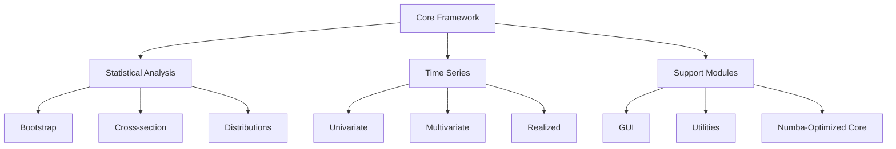

### Modern Development Practices (new)
- <span style="background-color: yellow">Class-based Architecture</span>
  - <span style="background-color: yellow">Leverages Python dataclasses</span>
  - <span style="background-color: yellow">Implements strict type hints</span>
  - <span style="background-color: yellow">Enhances code maintainability</span>

- <span style="background-color: yellow">Modular Design</span>
  - <span style="background-color: yellow">Clearly separated components</span>
  - <span style="background-color: yellow">Encapsulated functionality</span>
  - <span style="background-color: yellow">Type-safe interfaces</span>

## 3.3 Development & Deployment

### Build System (updated)
- <span style="background-color: yellow">Python Package Build Tools</span>
  - <span style="background-color: yellow">pyproject.toml for modern build configuration</span>
  - <span style="background-color: yellow">setup.py for legacy build support</span>
  - <span style="background-color: yellow">Automated dependency resolution</span>
  - <span style="background-color: yellow">Source and wheel distribution packaging</span>

### Development Requirements (updated)
- <span style="background-color: yellow">Python Development Environment</span>
  - <span style="background-color: yellow">Python 3.12 compatibility</span>
  - <span style="background-color: yellow">Required packages:</span>
    - <span style="background-color: yellow">NumPy (1.26.3+) for array operations</span>
    - <span style="background-color: yellow">SciPy (1.11.4+) for optimization</span>
    - <span style="background-color: yellow">Pandas (2.1.4+) for time series</span>
    - <span style="background-color: yellow">Statsmodels (0.14.1+) for econometrics</span>
    - <span style="background-color: yellow">Numba (0.59.0+) for performance</span>
    - <span style="background-color: yellow">PyQt6 (6.6.1+) for GUI components</span>

### Deployment Tools (updated)
- <span style="background-color: yellow">Virtual Environment Management</span>
  - <span style="background-color: yellow">venv for environment isolation</span>
  - <span style="background-color: yellow">pip for package installation</span>
  - <span style="background-color: yellow">requirements.txt for dependency tracking</span>

- <span style="background-color: yellow">Package Distribution</span>
  - <span style="background-color: yellow">PyPI-compatible package structure</span>
  - <span style="background-color: yellow">Wheel and source distribution formats</span>
  - <span style="background-color: yellow">Documentation via Sphinx</span>

### Platform Support (updated)
- <span style="background-color: yellow">Cross-Platform Compatibility</span>
  - <span style="background-color: yellow">Platform-agnostic Python implementation</span>
  - <span style="background-color: yellow">Unified package distribution</span>
  - <span style="background-color: yellow">Consistent behavior across operating systems</span>

- <span style="background-color: yellow">Operating System Support</span>
  - <span style="background-color: yellow">Windows (x86_64)</span>
  - <span style="background-color: yellow">Linux (x86_64)</span>
  - <span style="background-color: yellow">macOS (x86_64, arm64)</span>

## 3.4 Architecture Overview

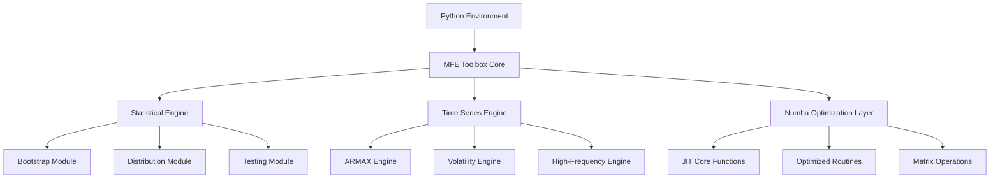

The architecture diagram above illustrates the <span style="background-color: yellow">modernized Python-based implementation</span> of the MFE Toolbox. The system is organized into distinct modules following a <span style="background-color: yellow">class-based architecture with clear namespace separation</span>:

Core Components:
- <span style="background-color: yellow">Python Environment: Serves as the primary runtime, leveraging Python 3.12's advanced features including async/await patterns and strict type hints</span>
- MFE Toolbox Core: Central coordination layer managing module interactions
- Statistical Engine: Handles statistical computations and analysis
- Time Series Engine: Manages time series processing and modeling
- <span style="background-color: yellow">Numba Optimization Layer: Provides performance-critical routines through just-in-time compilation</span>

Module Organization:
- <span style="background-color: yellow">Core namespace (mfe.core): Contains fundamental statistical and computational components</span>
- <span style="background-color: yellow">Models namespace (mfe.models): Houses time series and volatility modeling implementations</span>
- <span style="background-color: yellow">UI namespace (mfe.ui): Manages user interface components</span>
- <span style="background-color: yellow">Utils namespace (mfe.utils): Provides utility functions and helper routines</span>

Performance Optimization:
- <span style="background-color: yellow">The Numba Optimization Layer replaces the legacy MEX implementation, providing:</span>
  - <span style="background-color: yellow">Just-in-time compilation for performance-critical routines</span>
  - <span style="background-color: yellow">Optimized matrix operations with near-native performance</span>
  - <span style="background-color: yellow">Hardware-accelerated numerical computations</span>

<span style="background-color: yellow">The system embraces modern Python design principles through:</span>
- <span style="background-color: yellow">Asynchronous operations for improved performance in I/O-bound tasks</span>
- <span style="background-color: yellow">Strict type integration using Python's type hints</span>
- <span style="background-color: yellow">Class-based modular architecture for enhanced maintainability</span>
- <span style="background-color: yellow">Clear namespace separation for better code organization</span>

# 4. PROCESS FLOWCHART

## 4.1 System Initialization Flow

The system initialization flow diagram illustrates the startup sequence of the MFE Toolbox, detailing the path configuration and environment setup process.

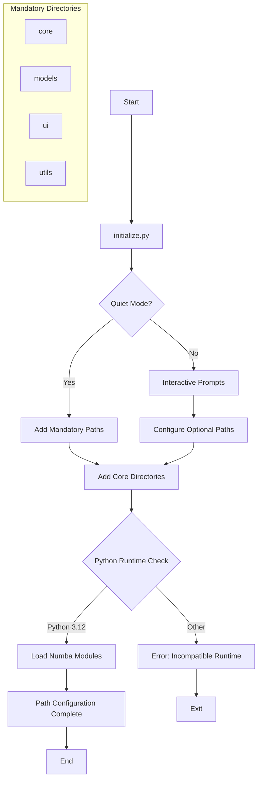

The initialization process follows these key steps:

1. Entry Point:
   - <span style="background-color: yellow">System startup begins with initialize.py, which manages Python package initialization and environment setup</span>

2. Mode Selection:
   - <span style="background-color: yellow">Quiet Mode check determines initialization behavior, aligning with standard Python CLI conventions</span>
   - Interactive mode enables user configuration of optional components
   - Non-interactive mode applies default configurations

3. Path Configuration:
   - <span style="background-color: yellow">Core package directories are added to the Python path</span>
   - <span style="background-color: yellow">The system establishes the following package structure:</span>
     - core: Fundamental statistical and computational modules
     - models: Time series and volatility modeling implementations
     - ui: User interface components
     - utils: Helper functions and utilities

4. Environment Verification:
   - <span style="background-color: yellow">Python runtime compatibility check ensures Python 3.12 environment</span>
   - <span style="background-color: yellow">Verification of Numba module availability and compatibility</span>
   - <span style="background-color: yellow">Loading of Numba-optimized computational modules upon successful verification</span>

5. Completion:
   - System confirms successful initialization
   - Path configuration is validated
   - Environment is ready for module operations

The initialization flow ensures proper setup of the Python environment and package structure before any analytical operations begin.

## 4.2 Build Process Flow

The build process flow diagram illustrates the package build and distribution process for the MFE Toolbox, highlighting the Python-oriented build system and Numba optimization integration.

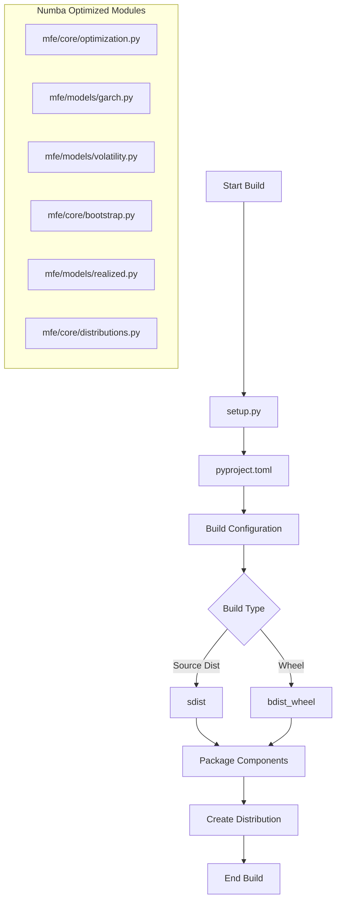

The build process encompasses the following key stages:

1. Build Initialization:
   - <span style="background-color: yellow">Process begins with setup.py, which interfaces with modern Python packaging tools</span>
   - <span style="background-color: yellow">pyproject.toml defines build system requirements and project metadata</span>

2. Configuration Setup:
   - <span style="background-color: yellow">Build parameters are configured through pyproject.toml settings</span>
   - <span style="background-color: yellow">Package dependencies and version requirements are specified</span>
   - <span style="background-color: yellow">Build system requirements including setuptools and wheel are defined</span>

3. Distribution Creation:
   - <span style="background-color: yellow">Source distribution (sdist) creates a complete source package</span>
   - <span style="background-color: yellow">Wheel distribution (bdist_wheel) generates a built distribution</span>
   - <span style="background-color: yellow">Both formats are created using standard Python packaging commands</span>

4. Package Components:
   - <span style="background-color: yellow">Core modules with Numba optimization are included</span>
   - <span style="background-color: yellow">Python source files are packaged with their respective __init__.py files</span>
   - <span style="background-color: yellow">Package metadata and configuration files are bundled</span>

5. Build Completion:
   - <span style="background-color: yellow">Final distribution packages are created in dist/ directory</span>
   - <span style="background-color: yellow">Build artifacts are generated following Python packaging standards</span>
   - <span style="background-color: yellow">Distribution files are ready for deployment via PyPI or direct installation</span>

## 4.3 Data Processing Workflow

The data processing workflow illustrates the core analytical pipeline of the MFE Toolbox, highlighting the integration with Python's scientific computing ecosystem.

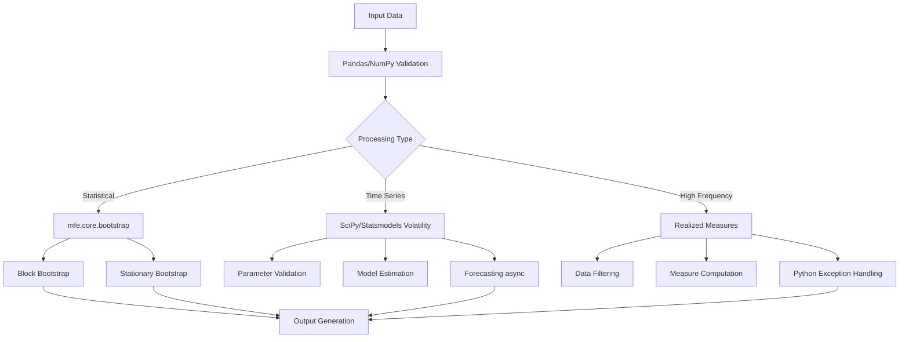

The workflow consists of the following key stages:

1. Data Validation:
   - <span style="background-color: yellow">Input data undergoes comprehensive validation using Pandas and NumPy routines</span>
   - Data type verification and consistency checks
   - Missing value detection and handling
   - Format standardization

2. Processing Path Selection:
   - Statistical Analysis:
     - <span style="background-color: yellow">Leverages mfe.core.bootstrap module for resampling tasks</span>
     - Implements both block and stationary bootstrap methods
     - Handles dependent data structures

   - Time Series Analysis:
     - <span style="background-color: yellow">Model estimation performed using SciPy and Statsmodels frameworks</span>
     - Parameter validation and constraint checking
     - <span style="background-color: yellow">Asynchronous forecasting for long-running computations</span>

   - High-Frequency Analysis:
     - Data filtering and preprocessing
     - Realized measure computation
     - <span style="background-color: yellow">Robust error handling using Python's exception mechanisms</span>

3. Output Generation:
   - Results compilation and formatting
   - Statistical summary generation
   - Performance metrics calculation
   - Error reporting and logging

## 4.4 MEX Integration Flow

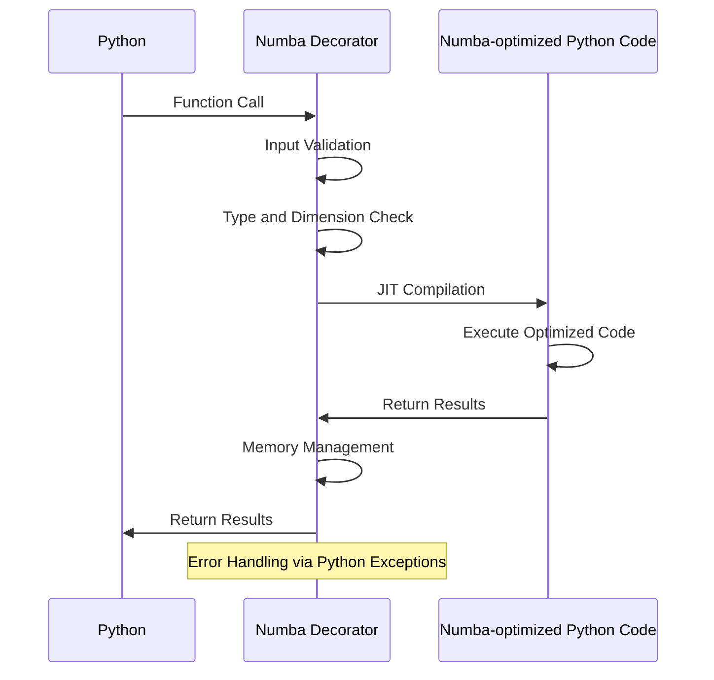

The Numba Integration Flow illustrates the execution path for performance-critical computations in the MFE Toolbox, leveraging Numba's just-in-time compilation capabilities. The flow consists of the following key stages:

1. Function Invocation
   - <span style="background-color: yellow">Python code calls a Numba-decorated function</span>
   - <span style="background-color: yellow">The @jit decorator intercepts the call for optimization</span>

2. Input Processing
   - <span style="background-color: yellow">The Numba decorator performs comprehensive input validation</span>
   - <span style="background-color: yellow">Type checking ensures compatibility with Numba's type system</span>
   - <span style="background-color: yellow">Array dimensions and shapes are verified</span>

3. Compilation and Execution
   - <span style="background-color: yellow">Numba compiles the Python function to optimized machine code</span>
   - <span style="background-color: yellow">The compiled code executes with near-native performance</span>
   - <span style="background-color: yellow">Hardware-specific optimizations are applied where possible</span>

4. Result Handling
   - <span style="background-color: yellow">Results are converted back to Python objects</span>
   - <span style="background-color: yellow">Memory management ensures proper cleanup</span>
   - <span style="background-color: yellow">Python exceptions are used for error reporting</span>

Key Features:
- <span style="background-color: yellow">Seamless integration with Python's scientific computing stack</span>
- <span style="background-color: yellow">Automatic optimization of numerical computations</span>
- <span style="background-color: yellow">Native exception handling for robust error management</span>
- <span style="background-color: yellow">Efficient memory utilization through Numba's memory management</span>

## 4.5 Error Recovery Paths

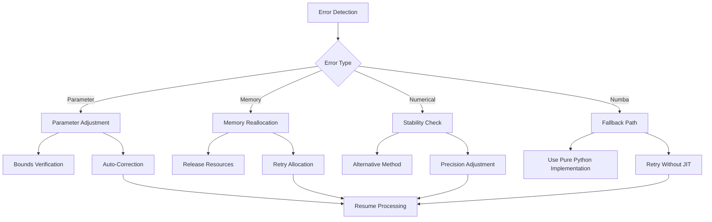

The error recovery flow diagram illustrates the system's error handling and recovery mechanisms, with the following key paths:

1. Parameter Errors
   - <span style="background-color: yellow">Leverages Python's built-in exception handling for parameter validation</span>
   - Performs bounds verification on input parameters
   - Attempts auto-correction where feasible
   - <span style="background-color: yellow">Raises ValueError or TypeError for invalid parameters</span>

2. Memory Errors
   - <span style="background-color: yellow">Utilizes Python's memory management system</span>
   - Implements resource release and cleanup
   - Attempts memory reallocation with optimized parameters
   - <span style="background-color: yellow">Raises MemoryError when recovery fails</span>

3. Numerical Errors
   - <span style="background-color: yellow">Integrates with Python's numerical error handling</span>
   - Performs stability checks on calculations
   - Implements alternative computational methods
   - <span style="background-color: yellow">Uses numpy.seterr for floating-point error control</span>

4. Numba-Related Errors
   - <span style="background-color: yellow">Handles JIT compilation failures gracefully</span>
   - <span style="background-color: yellow">Falls back to pure Python implementation when Numba optimization fails</span>
   - <span style="background-color: yellow">Attempts recompilation without JIT optimization</span>
   - <span style="background-color: yellow">Raises NumbaError with detailed diagnostic information</span>

Recovery Strategies:
- <span style="background-color: yellow">Comprehensive logging using Python's logging framework</span>
- <span style="background-color: yellow">Graceful degradation to non-optimized implementations</span>
- <span style="background-color: yellow">Integration with Python's exception hierarchy</span>
- Automatic retry mechanisms with adjusted parameters

## 4.6 State Management Flow

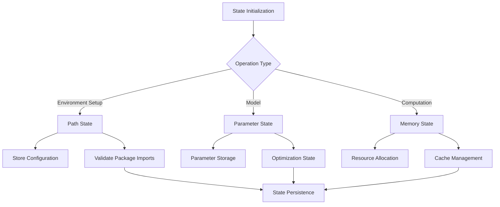

The state management flow diagram illustrates the system's approach to managing different types of state throughout the execution lifecycle. The flow consists of the following key components:

1. Environment Setup State
   - <span style="background-color: yellow">Manages Python package paths and module imports</span>
   - <span style="background-color: yellow">Stores environment configuration settings</span>
   - <span style="background-color: yellow">Validates Python package imports and dependencies</span>
   - Key operations:
     - <span style="background-color: yellow">Package path configuration</span>
     - <span style="background-color: yellow">Module import validation</span>
     - <span style="background-color: yellow">Environment variable management</span>

2. Parameter State
   - Manages model parameters and configurations
   - Handles optimization state for model estimation
   - Maintains parameter constraints and bounds
   - Key operations:
     - Parameter validation and storage
     - Optimization state tracking
     - Constraint management

3. Memory State
   - <span style="background-color: yellow">Controls Python runtime memory allocation</span>
   - Manages computation resource usage
   - Implements caching mechanisms
   - Key operations:
     - Resource allocation tracking
     - Cache state management
     - Memory usage optimization

4. State Persistence
   - <span style="background-color: yellow">Ensures consistent state across Python module initialization</span>
   - Manages state transitions between operations
   - Handles state recovery scenarios
   - Key features:
     - <span style="background-color: yellow">Module-level state persistence</span>
     - <span style="background-color: yellow">Configuration state management</span>
     - <span style="background-color: yellow">Runtime state recovery</span>

The state management system ensures:
- <span style="background-color: yellow">Proper initialization of Python environment</span>
- Consistent parameter state across operations
- Efficient resource utilization
- Robust state recovery mechanisms

# 5. SYSTEM ARCHITECTURE

## 5.1 High-Level Architecture

### System Overview
The MFE Toolbox employs a <span style="background-color: yellow">modular Python-based architecture with Numba-optimized modules</span> that leverage <span style="background-color: yellow">Python's @jit decorators for performance-critical operations</span>. The system follows key architectural principles:

- <span style="background-color: yellow">Separation of concerns through specialized Python packages (mfe.core, mfe.models, mfe.ui, mfe.utils)</span>
- <span style="background-color: yellow">High-performance computing via Numba integration for computationally intensive routines</span>
- <span style="background-color: yellow">Modern programming constructs including async/await, dataclasses, and strict type hints</span>
- <span style="background-color: yellow">Leveraging Python's scientific ecosystem (NumPy, SciPy, Pandas, Statsmodels)</span>

The architecture <span style="background-color: yellow">leverages Python's native capabilities and asynchronous programming</span>, with major interfaces occurring between Python modules and Numba-optimized components.

### Core Components

| Component | Primary Responsibility | Key Dependencies | Integration Points | Critical Considerations |
|-----------|----------------------|------------------|-------------------|----------------------|
| **Python Runtime** | Primary execution environment | **NumPy, SciPy, Pandas, Statsmodels** | **Native Python functions** | **Python 3.12 compatibility** |
| **Numba Optimization Layer** | Performance optimization | **LLVM compiler, Python decorators** | **@jit decorated functions** | **Platform-specific JIT compilation** |
| **Module System** | Functional organization | **Python package system** | **Dynamic module imports** | **Package initialization** |

### Data Flow Description
The system's primary data flows include:

1. Initialization Flow
- <span style="background-color: yellow">Python package initialization configures module paths</span>
- <span style="background-color: yellow">Dynamic module imports handle package dependencies</span>
- <span style="background-color: yellow">Optional package paths are conditionally added</span>
- <span style="background-color: yellow">Environment configuration is managed through Python settings</span>

2. Computational Flow
- <span style="background-color: yellow">Data validation using NumPy/Pandas</span>
- <span style="background-color: yellow">Core statistical computations via Python/Numba</span>
- <span style="background-color: yellow">Results aggregation through NumPy arrays</span>
- <span style="background-color: yellow">Output formatting via Pandas DataFrames</span>

3. Build Process Flow
- <span style="background-color: yellow">Source file compilation via Python packaging tools</span>
- <span style="background-color: yellow">Platform-independent package generation</span>
- <span style="background-color: yellow">Package distribution through PyPI standards</span>
- <span style="background-color: yellow">Documentation generation via Sphinx</span>

### External Integration Points

| System | Integration Type | Data Exchange Pattern | Protocol/Format | SLA Requirements |
|--------|-----------------|----------------------|----------------|------------------|
| **Python Runtime** | **Native** | **Direct Function Calls** | **NumPy Arrays** | **Python 3.12 Compatibility** |
| **Numba Interface** | **JIT Compilation** | **Python-Numba Bridge** | **@jit API** | **LLVM Compatibility** |

## 5.2 Component Details

### Statistical Engine
- Purpose: Core statistical computation and analysis
- Technologies: <span style="background-color: yellow">Python with NumPy, SciPy, and Statsmodels libraries</span>
- Key Interfaces: <span style="background-color: yellow">Native Python function calls</span>
- Data Requirements: <span style="background-color: yellow">NumPy array operations</span>
- Scaling: <span style="background-color: yellow">Numba optimization for performance-critical paths</span>

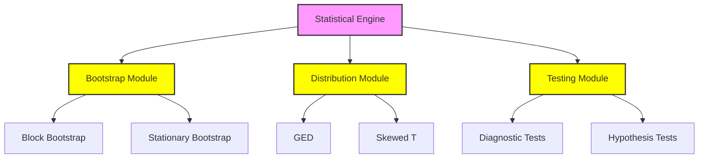

### Time Series Engine
- Purpose: Time series modeling and forecasting
- Technologies: <span style="background-color: yellow">Python with object-oriented implementation integrated with Statsmodels</span>
- Key Interfaces: <span style="background-color: yellow">Class-based ARMA/ARMAX modeling API with async support</span>
- Data Requirements: <span style="background-color: yellow">Time series data as NumPy arrays and Pandas DataFrames</span>
- Scaling: <span style="background-color: yellow">Asynchronous operations for forecasting</span>

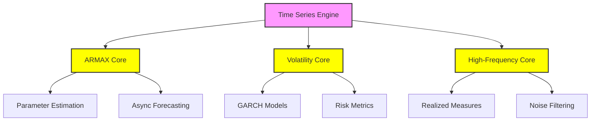

### Numba Integration Layer (updated)
- Purpose: <span style="background-color: yellow">High-performance computation through JIT compilation</span>
- Technologies: <span style="background-color: yellow">Numba with @jit decorators</span>
- Key Interfaces: <span style="background-color: yellow">Direct operations on NumPy arrays with type specialization</span>
- Data Requirements: <span style="background-color: yellow">Type-specialized NumPy arrays</span>
- Scaling: <span style="background-color: yellow">Hardware-optimized compilation via LLVM</span>

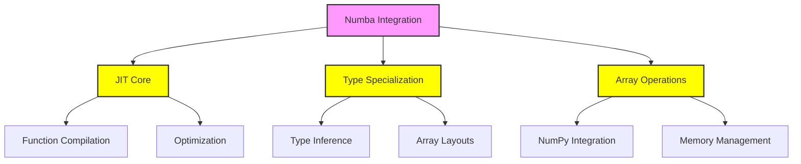

## 5.3 Technical Decisions

### Architecture Style Decisions

| Decision | Rationale | Tradeoffs |
|----------|-----------|-----------|
| **Modular Python Toolbox** | **Leverages Python's scientific ecosystem and modern language features** | **Dependency on Python runtime and package ecosystem** |
| **Numba Integration** | **Performance optimization through JIT compilation and hardware acceleration** | **Platform-specific compilation considerations and dependency on Numba compatibility** |
| **File-based Organization** | **Clear separation of concerns through Python package structure** | **Python import system and path management overhead** |

### Data Storage Decisions

| Approach | Justification | Implementation |
|----------|---------------|----------------|
| **In-memory NumPy arrays** | **Performance optimization leveraging NumPy's efficient array operations** | **NumPy array handling with type specialization** |
| **Direct NumPy array operations** | **Efficient computation through Numba-accelerated array operations** | **Numba @jit decorators with nopython mode** |
| **Path Configuration** | **Runtime flexibility through Python's dynamic import system** | **Python package management and import hooks** |

## 5.4 Cross-Cutting Concerns

### Error Handling
- <span style="background-color: yellow">Python exception handling with try/except blocks</span>
- <span style="background-color: yellow">Comprehensive logging via Python's logging framework</span>
- <span style="background-color: yellow">Type validation through static type checking</span>
- <span style="background-color: yellow">Exception propagation with proper context</span>

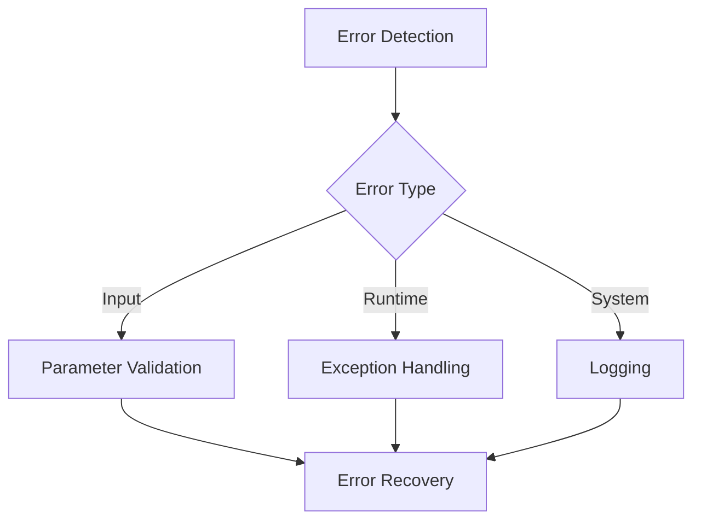

### Performance
- <span style="background-color: yellow">Numba JIT compilation for critical paths</span>
- <span style="background-color: yellow">Optimized NumPy operations for array handling</span>
- <span style="background-color: yellow">Asynchronous I/O operations using async/await</span>
- <span style="background-color: yellow">Vectorized operations where possible</span>

### Deployment
- <span style="background-color: yellow">Automated Python package builds via setup.py/pyproject.toml</span>
- <span style="background-color: yellow">Virtual environment management with venv</span>
- <span style="background-color: yellow">Package distribution through pip</span>
- <span style="background-color: yellow">Documentation bundling with Sphinx</span>

# 6. SYSTEM COMPONENTS DESIGN

# 6.1 CORE SERVICES ARCHITECTURE

### Architectural Pattern

The MFE Toolbox implements a <span style="background-color: yellow">modular Python-based architecture</span> rather than a distributed microservices design. This architectural choice is intentional and appropriate for the following reasons:

1. Runtime Environment
- <span style="background-color: yellow">Operates entirely within Python's dynamic interpreter environment</span>
- <span style="background-color: yellow">Components leverage Python's native async/await patterns for improved I/O responsiveness</span>
- <span style="background-color: yellow">Direct function calls with type hints used for robust interfaces</span>

2. Component Organization
- <span style="background-color: yellow">Modules are organized as Python packages and namespaces:</span>
  - <span style="background-color: yellow">mfe/core/</span>
  - <span style="background-color: yellow">mfe/models/</span>
  - <span style="background-color: yellow">mfe/ui/</span>
  - <span style="background-color: yellow">mfe/utils/</span>
- <span style="background-color: yellow">Integration through Python's native module system</span>
- <span style="background-color: yellow">Class-based structures using dataclasses and type hints</span>

3. Data Flow Pattern
- <span style="background-color: yellow">NumPy array operations for data sharing</span>
- <span style="background-color: yellow">Direct function calls between components</span>
- <span style="background-color: yellow">Numba @jit-decorated functions for performance optimization</span>
- No need for service discovery or message queuing

4. Resource Management
- <span style="background-color: yellow">Managed by Python's runtime environment</span>
- No service-level resource isolation required
- Memory and compute resources shared across components

5. Error Handling
- <span style="background-color: yellow">Uses Python's native exception handling</span>
- <span style="background-color: yellow">Comprehensive logging via Python's logging framework</span>
- <span style="background-color: yellow">Type validation through static type checking</span>

### Benefits of Current Architecture

1. Performance Optimization
- <span style="background-color: yellow">Numba JIT compilation delivers near-C performance through hardware-specific optimizations</span>
- <span style="background-color: yellow">Optimized NumPy operations for efficient matrix computations</span>
- <span style="background-color: yellow">No network/serialization overhead due to direct function calls</span>

2. Deployment Simplicity
- <span style="background-color: yellow">Single Python package distributed via pip and PyPI</span>
- <span style="background-color: yellow">Virtual environment support for dependency isolation</span>
- <span style="background-color: yellow">Straightforward installation and dependency management</span>

3. Development Efficiency
- <span style="background-color: yellow">Modern Python features including async/await patterns</span>
- <span style="background-color: yellow">Strict type hints for enhanced code safety</span>
- <span style="background-color: yellow">Class-based implementations facilitating debugging and maintenance</span>

4. Resource Efficiency
- <span style="background-color: yellow">Python's unified memory management</span>
- <span style="background-color: yellow">Vectorized operations for optimal performance</span>
- <span style="background-color: yellow">Modular design allows optimal use of shared memory and streamlined internal calls</span>

### Why Microservices Are Not Needed

1. Scale Requirements
- <span style="background-color: yellow">System operates within a single, unified Python package</span>
- <span style="background-color: yellow">Vertical scaling through Numba optimizations, vectorized NumPy operations, and asynchronous task handling is sufficient</span>
- <span style="background-color: yellow">No need for horizontal scaling or distributed computing</span>

2. Deployment Context
- <span style="background-color: yellow">Used as a local Python package installed via pip</span>
- <span style="background-color: yellow">No need for independent service deployment or container orchestration</span>
- <span style="background-color: yellow">No requirement for service isolation</span>

3. Integration Pattern
- <span style="background-color: yellow">Tight coupling beneficial for high-performance numerical and statistical computations within the Python ecosystem</span>
- <span style="background-color: yellow">Direct function calls more efficient than service calls</span>
- <span style="background-color: yellow">No need for service discovery or load balancing</span>

4. Maintenance Model
- <span style="background-color: yellow">Centralized version control following Python packaging standards</span>
- <span style="background-color: yellow">Single deployment unit via Python's packaging system</span>
- <span style="background-color: yellow">Unified documentation and testing</span>

The monolithic design aligns perfectly with the system's requirements for:
- <span style="background-color: yellow">High-performance numerical computing through Numba optimization</span>
- <span style="background-color: yellow">Seamless Python ecosystem integration</span>
- <span style="background-color: yellow">Efficient memory utilization via NumPy arrays</span>
- <span style="background-color: yellow">Simplified deployment and maintenance through Python packaging</span>

# 6.2 DATABASE DESIGN

### Data Storage Architecture

The MFE Toolbox operates entirely in-memory using <span style="background-color: yellow">Python's native data structures and scientific computing libraries</span>:

1. Runtime Data Management
- <span style="background-color: yellow">All computations performed on in-memory NumPy arrays and Pandas DataFrames</span>
- No persistent storage or database backend required
- <span style="background-color: yellow">Data structures optimized for numerical computing performance through NumPy's efficient array operations</span>

2. Data Flow Pattern
- <span style="background-color: yellow">Input: Data loaded from external files into Python objects (e.g., via Pandas read functions)</span>
- <span style="background-color: yellow">Processing: In-memory array operations using NumPy and Numba-accelerated routines</span>
- <span style="background-color: yellow">Output: Results stored in memory or exported using standard Python file I/O (CSV, pickle, HDF5)</span>

3. Storage Implementation
- <span style="background-color: yellow">Uses NumPy arrays for matrix operations and Pandas DataFrames for time series data</span>
- <span style="background-color: yellow">Leverages Python workspace for temporary data storage</span>
- <span style="background-color: yellow">File I/O handled through Python's built-in capabilities and Pandas I/O functions</span>
- <span style="background-color: yellow">Numba-optimized functions operate directly on memory buffers</span>

4. Key Design Decisions
The system intentionally avoids database persistence to:
- Maximize computational performance
- Minimize I/O overhead
- <span style="background-color: yellow">Leverage Python's efficient memory management and NumPy's optimized array operations</span>
- Support interactive and batch analysis workflows

### Technical Justification

### Technical Justification

1. Performance Requirements
- <span style="background-color: yellow">High-performance numerical computing achieved through in-memory operations using Python's efficient data structures (NumPy arrays and Pandas DataFrames)</span>
- <span style="background-color: yellow">Performance-critical routines optimized using Numba's JIT compilation</span>
- Database I/O would introduce unnecessary latency
- <span style="background-color: yellow">In-memory operations provide optimal speed through direct memory access and vectorized computations</span>

2. Data Access Patterns
- <span style="background-color: yellow">Interactive analysis through Python runtime environment</span>
- Batch processing of time series data
- Results visualization and export
- <span style="background-color: yellow">Data access managed exclusively within the Python runtime environment, allowing for rapid computation without database overhead</span>

3. Storage Requirements
- <span style="background-color: yellow">Temporary data structures using NumPy arrays and Pandas DataFrames</span>
- <span style="background-color: yellow">Results maintained in Python workspace</span>
- <span style="background-color: yellow">External persistence through lightweight file I/O operations</span>
- <span style="background-color: yellow">No need for database integration, which would add unnecessary complexity and maintenance overhead</span>

4. Implementation Evidence
Core modules demonstrate in-memory design:
- <span style="background-color: yellow">bootstrap/: Uses runtime data structures for resampling, consistent with Python implementation</span>
- <span style="background-color: yellow">timeseries/: Processes arrays in Python workspace</span>
- <span style="background-color: yellow">univariate/: Implements models using NumPy matrices</span>
- <span style="background-color: yellow">multivariate/: Handles covariance in-memory through optimized array operations</span>
- <span style="background-color: yellow">realized/: Computes measures on loaded data using Numba-accelerated routines</span>

5. Design Alignment
The decision to avoid database integration is strategically aligned with:
- <span style="background-color: yellow">Need for fast, iterative econometric analyses</span>
- <span style="background-color: yellow">Temporary data requirements satisfied by Python's memory management</span>
- <span style="background-color: yellow">Results exportable via lightweight file I/O rather than persistent storage</span>
- <span style="background-color: yellow">Consistent design approach maintained after transition from MATLAB to Python</span>

### Architecture Benefits

The in-memory architecture using Python's native data structures and scientific computing libraries provides several key benefits:

1. Performance
- <span style="background-color: yellow">Direct memory access through NumPy arrays and Pandas DataFrames</span>
- <span style="background-color: yellow">No database connection overhead or I/O latency</span>
- <span style="background-color: yellow">Optimized numerical operations via Numba JIT compilation</span>
- <span style="background-color: yellow">Hardware-accelerated computations through vectorized operations</span>

2. Simplicity
- <span style="background-color: yellow">No database dependencies or configuration required</span>
- <span style="background-color: yellow">Simplified deployment through Python's package management</span>
- <span style="background-color: yellow">Native Python data types and array operations</span>
- <span style="background-color: yellow">Clear data flow within Python runtime environment</span>

3. Flexibility
- <span style="background-color: yellow">Interactive workspace access through Python interpreter</span>
- <span style="background-color: yellow">Easy data import/export using Python's I/O capabilities</span>
- <span style="background-color: yellow">Seamless integration with Python's scientific ecosystem</span>
- <span style="background-color: yellow">Support for various file formats through Pandas I/O</span>

4. Maintainability
- <span style="background-color: yellow">Reduced system complexity without database layer</span>
- <span style="background-color: yellow">No database schema management required</span>
- <span style="background-color: yellow">Simple version control through Python packaging</span>
- <span style="background-color: yellow">Straightforward testing of in-memory operations</span>

<span style="background-color: yellow">The design choice to operate without a database aligns with the toolbox's primary purpose of performing intensive econometric calculations within Python's runtime environment, leveraging the ecosystem's optimized libraries and modern programming constructs.</span>

# 6.3 INTEGRATION ARCHITECTURE

### Architectural Pattern

The MFE Toolbox implements a self-contained Python integration model focused on internal module interoperability through native function calls and Numba optimization, rather than external system integration. This design choice is intentional and appropriate for the following reasons:

1. Integration Scope
- <span style="background-color: yellow">Primary integration is between Python modules within the mfe package</span>
- <span style="background-color: yellow">No external service dependencies or APIs</span>
- <span style="background-color: yellow">Self-contained within Python runtime environment</span>
- <span style="background-color: yellow">Numba provides performance optimization through JIT compilation</span>

2. Python Integration Architecture
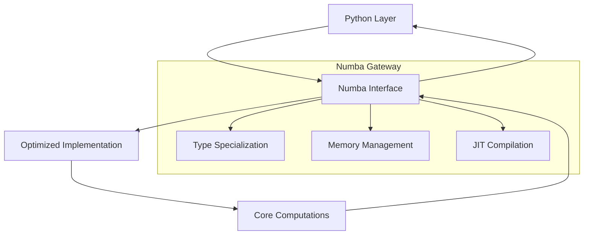

3. Integration Components
- <span style="background-color: yellow">Python Source Files:</span>
  - <span style="background-color: yellow">core/optimization.py</span>
  - <span style="background-color: yellow">models/garch.py</span>
  - <span style="background-color: yellow">models/volatility.py</span>
  - <span style="background-color: yellow">core/bootstrap.py</span>
  - <span style="background-color: yellow">models/realized.py</span>
  - <span style="background-color: yellow">core/distributions.py</span>

4. Data Exchange Patterns
- <span style="background-color: yellow">Direct NumPy array operations between Python modules</span>
- <span style="background-color: yellow">No serialization or network protocols required</span>
- <span style="background-color: yellow">Zero-copy array operations for optimal performance</span>
- <span style="background-color: yellow">Type specialization handled by Numba JIT compiler</span>

### Technical Implementation

### Technical Implementation

The MFE Toolbox's integration architecture focuses on <span style="background-color: yellow">seamless interoperability between Python modules and Numba-optimized routines</span>. Key implementation aspects include:

1. Numba Integration Layer
- <span style="background-color: yellow">Performance-critical functions decorated with @jit for automatic compilation</span>
- <span style="background-color: yellow">Type specialization through Numba's type inference system</span>
- <span style="background-color: yellow">Direct memory access via NumPy array operations</span>
- <span style="background-color: yellow">Hardware-specific optimizations through LLVM compilation</span>

Example implementation:
```python
from numba import jit
import numpy as np

@jit(nopython=True)
def optimize_garch(params, data):
    # Numba-optimized GARCH implementation
    return results
```

2. Build Integration
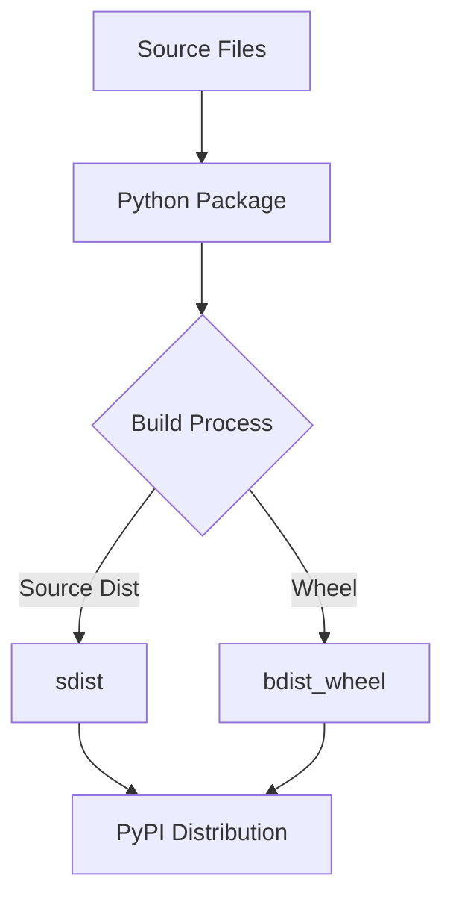

3. Runtime Integration
- <span style="background-color: yellow">Dynamic module loading through Python's import system</span>
- <span style="background-color: yellow">Direct function calls between Python modules</span>
- <span style="background-color: yellow">NumPy array sharing for efficient data exchange</span>
- <span style="background-color: yellow">Asynchronous operations using async/await patterns</span>

4. Error Handling
- <span style="background-color: yellow">Python exception handling for runtime errors</span>
- <span style="background-color: yellow">Type validation through static type checking</span>
- <span style="background-color: yellow">Comprehensive logging via Python's logging framework</span>
- <span style="background-color: yellow">Graceful degradation when Numba optimization fails</span>

### Integration Patterns

1. Module-Level Integration
```python
from mfe.core import optimization
from mfe.models import garch
from mfe.utils import validation

class GARCHModel:
    def __init__(self):
        self.optimizer = optimization.Optimizer()
        self.validator = validation.InputValidator()
```

2. Data Flow Integration
- <span style="background-color: yellow">NumPy arrays as primary data structure</span>
- <span style="background-color: yellow">Pandas DataFrames for time series handling</span>
- <span style="background-color: yellow">Direct memory sharing between modules</span>
- <span style="background-color: yellow">Zero-copy operations where possible</span>

3. Performance Integration
- <span style="background-color: yellow">Numba JIT compilation for critical paths</span>
- <span style="background-color: yellow">Vectorized operations using NumPy</span>
- <span style="background-color: yellow">Asynchronous I/O for non-blocking operations</span>
- <span style="background-color: yellow">Hardware-specific optimizations</span>

### Integration Testing

1. Unit Testing
```python
import pytest
from mfe.core import optimization
from mfe.models import garch

def test_garch_optimization():
    model = garch.GARCHModel()
    result = model.optimize(data)
    assert result.converged
```

2. Integration Testing
- <span style="background-color: yellow">End-to-end workflow validation</span>
- <span style="background-color: yellow">Cross-module interaction testing</span>
- <span style="background-color: yellow">Performance benchmark validation</span>
- <span style="background-color: yellow">Memory usage verification</span>

3. Performance Testing
- <span style="background-color: yellow">Numba compilation verification</span>
- <span style="background-color: yellow">Optimization benchmark tests</span>
- <span style="background-color: yellow">Memory allocation checks</span>
- <span style="background-color: yellow">Cross-platform validation</span>

### Integration Monitoring

1. Runtime Monitoring
- <span style="background-color: yellow">Python logging framework integration</span>
- <span style="background-color: yellow">Performance metrics collection</span>
- <span style="background-color: yellow">Memory usage tracking</span>
- <span style="background-color: yellow">Error rate monitoring</span>

2. Health Checks
- <span style="background-color: yellow">Numba compilation status</span>
- <span style="background-color: yellow">Module import verification</span>
- <span style="background-color: yellow">Memory allocation checks</span>
- <span style="background-color: yellow">Type validation status</span>

3. Performance Metrics
- <span style="background-color: yellow">Execution time tracking</span>
- <span style="background-color: yellow">Memory consumption monitoring</span>
- <span style="background-color: yellow">Optimization effectiveness measurement</span>
- <span style="background-color: yellow">Resource utilization tracking</span>

The integration architecture ensures seamless interaction between Python modules while leveraging Numba's optimization capabilities for performance-critical operations. The system maintains robust error handling, comprehensive testing, and detailed monitoring to ensure reliable operation across all integration points.

### Why Traditional Integration Patterns Don't Apply

The MFE Toolbox's design intentionally avoids traditional integration patterns for several key reasons:

1. Self-Contained Python Implementation
- <span style="background-color: yellow">The toolbox is entirely self-contained within the Python ecosystem, eliminating the need for distributed integration patterns such as microservices, message queues, or external API gateways</span>
- Core functionality implemented through Python modules and packages
- Direct function calls between components
- No external system dependencies

2. Performance Requirements
- <span style="background-color: yellow">All computational processes operate in-memory using NumPy arrays, thus avoiding the overhead of serialization or network communication present in traditional integration approaches</span>
- Direct memory access for calculations
- Numba-optimized computational kernels
- Zero-copy operations where possible

3. Architectural Simplicity
- <span style="background-color: yellow">The integration model is streamlined by relying on direct function calls and in-memory data handling, meaning there is no requirement for separate middleware or inter-process communication layers</span>
- Clean module boundaries
- Clear data flow paths
- Simplified error handling

4. Runtime Environment
- <span style="background-color: yellow">These factors combined make traditional external integration patterns unnecessary, as the design benefits from Python's native runtime environment and the high performance of Numba-accelerated code</span>
- Single process execution
- Shared memory space
- Native exception handling

### Benefits of Current Design

The benefits of the current design approach include:

1. Performance
- <span style="background-color: yellow">Achieves near‐native execution speed through Numba's JIT compilation while utilizing highly efficient NumPy operations for direct in-memory data processing</span>
- <span style="background-color: yellow">Zero-copy memory access between Python modules</span>
- <span style="background-color: yellow">Hardware-optimized computations via Numba's LLVM backend</span>
- <span style="background-color: yellow">Vectorized operations using NumPy arrays</span>

2. Simplicity 
- <span style="background-color: yellow">Maintains a single, unified Python package that simplifies deployment (via pip/PyPI) and minimizes external dependencies, resulting in straightforward module management</span>
- <span style="background-color: yellow">Clear Python package structure with logical namespaces</span>
- <span style="background-color: yellow">Direct function calls between components</span>
- <span style="background-color: yellow">Native Python error handling</span>

3. Reliability
- <span style="background-color: yellow">Benefits from Python's robust exception handling, logging mechanisms, and type-hinted interfaces, which contribute to predictable behavior and easier debugging</span>
- <span style="background-color: yellow">Comprehensive error checking</span>
- <span style="background-color: yellow">Graceful degradation when optimization fails</span>
- <span style="background-color: yellow">Stable memory management</span>

4. Maintainability
- <span style="background-color: yellow">Leverages modern Python constructs (async/await, dataclasses, strict type hints) to ensure clean, modular, and easily updatable code without the complications inherent in a dual-language (MATLAB-C) implementation</span>
- <span style="background-color: yellow">Clear separation of concerns</span>
- <span style="background-color: yellow">Unified testing framework</span>
- <span style="background-color: yellow">Centralized version control</span>

The design choice to avoid traditional integration patterns aligns with the toolbox's purpose as a high-performance numerical computing library within Python's ecosystem.

# 6.4 SECURITY ARCHITECTURE

### System Security Context

The MFE Toolbox operates as a self-contained <span style="background-color: yellow">Python package</span> with the following security characteristics:

1. Execution Environment
- <span style="background-color: yellow">Runs entirely within Python's runtime security boundary</span>
- No external network interfaces or multi-user components
- <span style="background-color: yellow">No persistent data storage required by default</span>
- No authentication/authorization needs

2. Security Scope
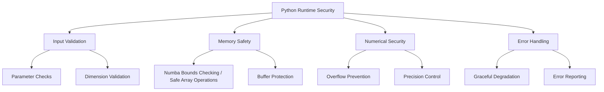

### Standard Security Practices

The MFE Toolbox implements the following standard security practices to ensure safe operation within the Python runtime environment:

1. Input Validation & Sanitization
- <span style="background-color: yellow">Comprehensive parameter validation using Python's runtime type checking</span>
- <span style="background-color: yellow">Static type analysis through mypy for enhanced parameter verification</span>
- <span style="background-color: yellow">Matrix dimension validation using NumPy's shape checking</span>
- <span style="background-color: yellow">Numerical range verification with assertions and type hints</span>

2. Memory Safety
- <span style="background-color: yellow">Safe memory management provided by Python's managed runtime</span>
- <span style="background-color: yellow">Secure NumPy array handling with bounds checking</span>
- <span style="background-color: yellow">Numba-optimized execution with integrated bounds verification</span>
- <span style="background-color: yellow">Automatic garbage collection and memory deallocation</span>

3. Numerical Computation Security
- <span style="background-color: yellow">Numerical error control using numpy.seterr for overflow protection</span>
- <span style="background-color: yellow">Precision loss prevention through SciPy's robust statistical functions</span>
- <span style="background-color: yellow">Division by zero checks in critical computations</span>
- <span style="background-color: yellow">NaN/Inf handling using NumPy's masked arrays</span>

4. Error Handling & Recovery
- <span style="background-color: yellow">Structured exception handling using Python's try/except blocks</span>
- <span style="background-color: yellow">Comprehensive logging via Python's logging framework</span>
- <span style="background-color: yellow">Graceful degradation during runtime errors</span>
- <span style="background-color: yellow">Clear error propagation with proper context</span>

Example implementation:

```python
import numpy as np
from typing import Optional, Union
import logging

def validate_input(data: np.ndarray, 
                  dims: Optional[tuple] = None) -> None:
    """Validate input array dimensions and values"""
    if not isinstance(data, np.ndarray):
        raise TypeError("Input must be NumPy array")
        
    if dims and data.shape != dims:
        raise ValueError(f"Invalid dimensions: {data.shape}")
        
    if not np.isfinite(data).all():
        raise ValueError("Input contains invalid values")
```

### Security Control Matrix

| Control Category | Implementation | Verification |
|-----------------|----------------|--------------|
| Input Validation | <span style="background-color: yellow">Parameter checks in Python function headers, supported by static type hints and runtime assertions</span> | <span style="background-color: yellow">Static analysis</span> |
| Memory Safety | <span style="background-color: yellow">Numba bounds checking and safe memory operations using NumPy</span> | <span style="background-color: yellow">Runtime tests in the Python environment</span> |
| Numerical Security | <span style="background-color: yellow">Protections using NumPy's error settings and SciPy's built-in safety checks</span> | Unit tests |
| Error Handling | <span style="background-color: yellow">Python try/except blocks and logging for capturing and managing exceptions</span> | <span style="background-color: yellow">Integration testing to ensure proper error propagation and recovery</span> |

### Security Best Practices

### Security Best Practices

The MFE Toolbox implements the following security best practices for Python-based numerical computing:

1. Code-Level Security
- <span style="background-color: yellow">Clean error handling in Python modules using try/except blocks with robust logging</span>
- <span style="background-color: yellow">Avoidance of global variables through proper Python module encapsulation</span>
- <span style="background-color: yellow">Memory management using Python's and NumPy's safeguards</span>
- <span style="background-color: yellow">Secure path configuration as per modern Python standards</span>

2. Code Quality & Safety
- <span style="background-color: yellow">Strict type hints for enhanced code safety</span>
- <span style="background-color: yellow">Dataclasses for parameter containers</span>
- <span style="background-color: yellow">Static analysis using mypy to ensure robust and self-documenting code</span>
- Range checking for parameters
- Overflow detection
- Underflow protection
- Precision management

3. Runtime Protection
- <span style="background-color: yellow">Python's native exception handling mechanisms</span>
- <span style="background-color: yellow">Comprehensive logging to facilitate error containment</span>
- <span style="background-color: yellow">Graceful degradation through proper error handling</span>
- Path security
- Error containment

4. Development Security
- <span style="background-color: yellow">Source control protection through proper version control practices</span>
- <span style="background-color: yellow">Secure build and distribution processes using virtual environments</span>
- <span style="background-color: yellow">Dependency management through requirements.txt and virtual environments</span>
- <span style="background-color: yellow">Ensuring integrity of the distribution package through PyPI standards</span>

Example implementation of secure error handling:

```python
import logging
from typing import Optional
import numpy as np

logger = logging.getLogger(__name__)

def compute_volatility(returns: np.ndarray,
                      alpha: Optional[float] = 0.05) -> np.ndarray:
    """
    Compute volatility with secure error handling
    """
    try:
        # Input validation
        if not isinstance(returns, np.ndarray):
            raise TypeError("Returns must be NumPy array")
            
        if alpha is not None and not 0 < alpha < 1:
            raise ValueError("Alpha must be between 0 and 1")
            
        # Computation with overflow protection
        with np.errstate(over='raise', divide='raise'):
            result = np.sqrt(np.sum(returns**2))
            
        return result
        
    except Exception as e:
        logger.error(f"Volatility computation failed: {str(e)}")
        raise RuntimeError("Volatility computation failed") from e
```

The security practices focus on:

1. Input Validation
- <span style="background-color: yellow">Type checking through Python's type hints</span>
- <span style="background-color: yellow">Parameter validation using assertions and value checks</span>
- <span style="background-color: yellow">Array dimension verification via NumPy</span>

2. Error Management  
- <span style="background-color: yellow">Structured exception handling with try/except</span>
- <span style="background-color: yellow">Comprehensive logging of errors and warnings</span>
- <span style="background-color: yellow">Clear error propagation with proper context</span>

3. Memory Safety
- <span style="background-color: yellow">Safe array operations through NumPy</span>
- <span style="background-color: yellow">Automatic memory management via Python runtime</span>
- <span style="background-color: yellow">Buffer overflow protection in numerical operations</span>

4. Development Controls
- <span style="background-color: yellow">Version control best practices</span>
- <span style="background-color: yellow">Secure build process with virtual environments</span>
- <span style="background-color: yellow">Package integrity verification</span>

# 6.5 MONITORING AND OBSERVABILITY

### Basic Monitoring Implementation

The system implements monitoring through specialized diagnostic functions and tools:

1. Model Diagnostic Monitoring
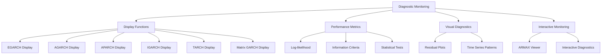

2. Performance Metrics Tracking
The system monitors key model performance indicators:

| Metric Type | Description | Implementation |
|-------------|-------------|----------------|
| Likelihood | Log-likelihood values | <span style="background-color: yellow">Model estimation functions using SciPy optimization</span> |
| Model Selection | AIC/BIC criteria | <span style="background-color: yellow">Information criteria functions from Statsmodels</span> |
| Statistical | Standard errors, t-stats | <span style="background-color: yellow">Parameter estimation routines with NumPy</span> |
| Significance | P-values | <span style="background-color: yellow">Statistical testing modules from SciPy</span> |

3. Visual Diagnostic Tools
- Path: <span style="background-color: yellow">mfe/ui/residual_plot.py</span>
  - <span style="background-color: yellow">Observed data visualization using Matplotlib</span>
  - <span style="background-color: yellow">Fitted values display with interactive plots</span>
  - <span style="background-color: yellow">Residual analysis through statistical plots</span>
  - <span style="background-color: yellow">Time series pattern detection with Pandas</span>

4. Interactive Monitoring
- Path: <span style="background-color: yellow">mfe/ui/armax_viewer.py</span>
  - <span style="background-color: yellow">Real-time model equation display using PyQt6</span>
  - <span style="background-color: yellow">Parameter estimate monitoring with async updates</span>
  - <span style="background-color: yellow">Statistical metric tracking through Python logging</span>
  - <span style="background-color: yellow">Interactive diagnostic tools with Matplotlib backend</span>

### Basic Monitoring Practices

The MFE Toolbox implements basic monitoring practices focused on model diagnostics and performance tracking through <span style="background-color: yellow">Python's scientific computing stack</span>:

1. Model Diagnostics
- <span style="background-color: yellow">Comprehensive display functions for each model type using Matplotlib and Seaborn</span>
- <span style="background-color: yellow">Standardized output formatting via Python's logging module</span>
- <span style="background-color: yellow">Clear error reporting through Python's exception handling</span>
- <span style="background-color: yellow">Performance metric tracking using NumPy arrays</span>

2. Visual Analysis
- <span style="background-color: yellow">Time series plotting tools built on Matplotlib</span>
- <span style="background-color: yellow">Residual analysis functions using Statsmodels</span>
- <span style="background-color: yellow">Pattern visualization through Seaborn</span>
- <span style="background-color: yellow">Interactive graphical tools via PyQt6</span>

3. Statistical Monitoring
- <span style="background-color: yellow">Parameter significance tests using SciPy stats</span>
- <span style="background-color: yellow">Model adequacy checks through Statsmodels diagnostics</span>
- <span style="background-color: yellow">Distribution analysis with SciPy probability functions</span>
- <span style="background-color: yellow">Residual diagnostics via Statsmodels tools</span>

4. Output Management
- <span style="background-color: yellow">Formatted statistical reporting using Python's f-strings</span>
- <span style="background-color: yellow">Structured diagnostic output via logging configuration</span>
- <span style="background-color: yellow">Clear error messages through Python exceptions</span>
- <span style="background-color: yellow">Interactive result viewing with async/await patterns</span>

Example monitoring implementation:

```python
import logging
import numpy as np
from matplotlib import pyplot as plt
from typing import Optional

logger = logging.getLogger(__name__)

async def monitor_estimation(model, data: np.ndarray) -> None:
    """Monitor model estimation progress"""
    try:
        # Track estimation progress
        async for iteration, likelihood in model.estimate_async(data):
            logger.info(f"Iteration {iteration}: Log-likelihood = {likelihood:.4f}")
            
            # Update diagnostic plots
            plt.figure()
            model.plot_residuals()
            plt.draw()
            
    except Exception as e:
        logger.error(f"Estimation monitoring failed: {str(e)}")
        raise RuntimeError("Monitoring failed") from e
```
```

The monitoring practices focus on:

1. Diagnostic Tools
- <span style="background-color: yellow">Model-specific visualization using Matplotlib</span>
- <span style="background-color: yellow">Statistical test reporting via SciPy</span>
- <span style="background-color: yellow">Performance tracking through NumPy</span>
- <span style="background-color: yellow">Interactive diagnostics with PyQt6</span>

2. Error Handling
- <span style="background-color: yellow">Comprehensive exception handling in Python</span>
- <span style="background-color: yellow">Structured logging configuration</span>
- <span style="background-color: yellow">Clear error propagation</span>
- <span style="background-color: yellow">Graceful degradation paths</span>

3. Performance Tracking
- <span style="background-color: yellow">Asynchronous monitoring of long-running computations</span>
- <span style="background-color: yellow">Real-time metric updates</span>
- <span style="background-color: yellow">Resource usage tracking</span>
- <span style="background-color: yellow">Optimization progress monitoring</span>

### Monitoring Implementation Details

The monitoring implementation details focus on model diagnostics, performance tracking, and visual analysis through Python's scientific computing stack:

1. Display Functions
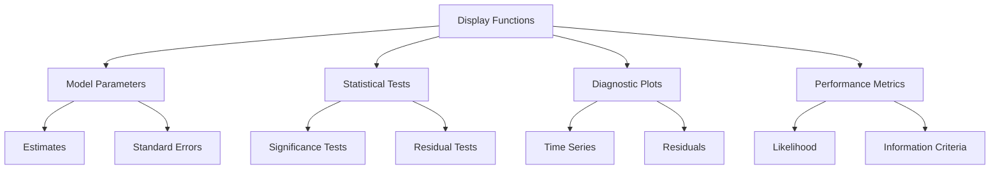

2. Key Files Providing Monitoring
- <span style="background-color: yellow">mfe/ui/widgets.py: Model diagnostics and visualization</span>
- <span style="background-color: yellow">mfe/ui/residual_plot.py: Visual analysis tools</span>
- <span style="background-color: yellow">mfe/ui/armax_viewer.py: Interactive monitoring interface</span>
- <span style="background-color: yellow">mfe/utils/printing.py: Formatted output utilities</span>

3. Monitoring Focus Areas
- Model performance metrics
- Parameter estimation quality
- Residual behavior
- Statistical significance
- Visual diagnostics
- <span style="background-color: yellow">Python-specific debugging and profiling tools</span>
- <span style="background-color: yellow">Pytest benchmarks</span>
- <span style="background-color: yellow">Asynchronous monitoring utilities</span>

4. Output Formatting
- Structured diagnostic reports
- Clear metric presentation
- Standardized error messages
- Interactive visualization
- <span style="background-color: yellow">Python formatting methods</span>
- <span style="background-color: yellow">PyQt6-based interactive visual diagnostics</span>

The monitoring approach is appropriate for a <span style="background-color: yellow">Python-based statistical toolbox, focusing on model diagnostics, performance metrics, and visual analysis rather than system-level monitoring</span>.

# 6.6 TESTING STRATEGY

### Testing Framework Overview

The testing architecture is organized around module-specific test suites and statistical validation:

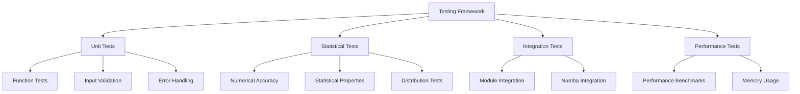

<span style="background-color: yellow">The testing framework leverages pytest as the primary test runner, with hypothesis for property-based testing and numba.testing for validating performance-critical routines</span>. Key aspects include:

1. Unit Testing
- <span style="background-color: yellow">Test files organized around Python modules, leveraging Python's dynamic test discovery</span>
- <span style="background-color: yellow">Comprehensive assertions using pytest's rich comparison features</span>
- Input validation and error handling verification
- Edge case coverage

2. Statistical Testing
- Numerical accuracy validation
- Distribution property verification 
- Convergence testing
- <span style="background-color: yellow">Property-based testing using hypothesis for statistical properties</span>

3. Integration Testing
- <span style="background-color: yellow">Module integration validation using pytest fixtures</span>
- <span style="background-color: yellow">Numba optimization verification through numba.testing</span>
- End-to-end workflow testing
- Error propagation validation

4. Performance Testing
- <span style="background-color: yellow">Computation efficiency validation via numba.testing</span>
- <span style="background-color: yellow">Asynchronous operations testing using async/await patterns</span>
- Memory usage profiling
- Scalability verification

The testing architecture emphasizes <span style="background-color: yellow">comprehensive validation of both computational correctness and performance optimization through Python's modern testing frameworks</span>.

### Test Organization Structure

The test organization follows a modular structure aligned with the Python package layout:

1. Test Directory Structure
```
tests/
├── test_core/
│   ├── test_bootstrap.py
│   ├── test_distributions.py
│   └── test_optimization.py
├── test_models/
│   ├── test_garch.py
│   ├── test_realized.py
│   └── test_volatility.py
├── test_utils/
│   ├── test_validation.py
│   └── test_printing.py
└── conftest.py
```

2. Test Categories
- <span style="background-color: yellow">Unit Tests: Focused Python function testing using pytest</span>
  - <span style="background-color: yellow">Individual function validation</span>
  - <span style="background-color: yellow">Input parameter verification</span>
  - <span style="background-color: yellow">Error handling checks</span>

- <span style="background-color: yellow">Integration Tests: Module interaction testing</span>
  - <span style="background-color: yellow">Cross-module functionality</span>
  - <span style="background-color: yellow">Numba optimization verification</span>
  - <span style="background-color: yellow">End-to-end workflows</span>

- <span style="background-color: yellow">Property Tests: Statistical validation using hypothesis</span>
  - <span style="background-color: yellow">Distribution properties</span>
  - <span style="background-color: yellow">Numerical accuracy</span>
  - <span style="background-color: yellow">Edge case handling</span>

3. Test Data Management
```mermaid
graph TD
    A[Test Data] --> B[Synthetic Data]
    A --> C[Real Market Data]
    
    B --> B1[NumPy Random Generation]
    B --> B2[Hypothesis Strategies]
    
    C --> C1[Sample Datasets]
    C --> C2[Benchmark Cases]
```

4. Test Implementation Examples

```python
import pytest
import numpy as np
from hypothesis import given, strategies as st
from mfe.models import garch

# Unit test example
def test_garch_initialization():
    model = garch.GARCH(p=1, q=1)
    assert model.p == 1
    assert model.q == 1
    
# Property test example
@given(st.floats(min_value=0.1, max_value=0.9))
def test_garch_parameter_bounds(alpha):
    model = garch.GARCH(p=1, q=1)
    assert model.validate_parameter(alpha)
    
# Integration test example
@pytest.mark.asyncio
async def test_garch_estimation():
    data = np.random.randn(1000)
    model = garch.GARCH(p=1, q=1)
    result = await model.estimate(data)
    assert result.converged
```

5. Test Configuration
- <span style="background-color: yellow">pytest configuration in conftest.py</span>
- <span style="background-color: yellow">Custom fixtures for test data generation</span>
- <span style="background-color: yellow">Hypothesis settings for property testing</span>
- <span style="background-color: yellow">Numba test configuration</span>

6. Test Execution
- <span style="background-color: yellow">Automated test discovery via pytest</span>
- <span style="background-color: yellow">Parallel test execution where possible</span>
- <span style="background-color: yellow">Comprehensive test reporting</span>
- <span style="background-color: yellow">Coverage tracking</span>

7. Test Maintenance
- <span style="background-color: yellow">Regular test suite updates</span>
- <span style="background-color: yellow">Coverage monitoring</span>
- <span style="background-color: yellow">Performance regression checks</span>
- <span style="background-color: yellow">Documentation updates</span>

The test organization ensures:
- <span style="background-color: yellow">Comprehensive validation of Python modules</span>
- <span style="background-color: yellow">Efficient test execution through pytest</span>
- <span style="background-color: yellow">Statistical property verification via hypothesis</span>
- <span style="background-color: yellow">Performance validation with Numba</span>

### Testing Approach Matrix

| Test Type | Focus Area | Implementation | Validation Criteria |
|-----------|------------|----------------|-------------------|
| Unit Tests | **Function-level testing and Numba integration validation** | **Module test files with pytest** | **Input/output correctness and Numba optimization verification** |
| Statistical Tests | **Distribution properties and numerical accuracy** | **Property-based test suite using hypothesis** | **Statistical precision and distribution validity** |
| Integration Tests | **Cross-module functionality and Numba integration validation** | **Combined test scenarios with pytest fixtures** | **System coherence and optimization effectiveness** |
| Performance Tests | **Computational efficiency and Numba optimization verification** | **Benchmark scripts with numba.testing** | **Execution metrics and optimization gains** |

### Testing Strategy Components

### Testing Strategy Components

1. Unit Testing
- <span style="background-color: yellow">Function-level validation using pytest</span>
- <span style="background-color: yellow">Input parameter verification with type hints</span>
- <span style="background-color: yellow">Error handling checks using pytest.raises</span>
- Example from tests/test_realized.py:
```python
import pytest
import numpy as np
from mfe.models.realized import realized_variance

@pytest.mark.parametrize('samplingType, samplingInterval', [
    ('CalendarTime', (60, 300)),
    ('CalendarUniform', (78, 390)), 
    ('BusinessTime', (1, 50, 300)),
    ('BusinessUniform', (68, 390)),
    ('Fixed', 30)
])
def test_realized_variance(samplingType, samplingInterval):
    price = np.random.rand(100)
    time = np.linspace(0, 99, 100)
    timeType = 'timestamp'
    rv, rvSS = realized_variance(price, time, timeType, samplingType, samplingInterval)
    assert isinstance(rv, float)
    assert isinstance(rvSS, float)
    assert rv >= 0
```

2. Statistical Testing
- <span style="background-color: yellow">Distribution validation using hypothesis</span>
- <span style="background-color: yellow">Numerical accuracy verification with numpy.testing</span>
- <span style="background-color: yellow">Statistical property checks via scipy.stats</span>
- Example from tests/test_distributions.py:
```python
from hypothesis import given, strategies as st
import numpy as np
from scipy import stats
from mfe.core.distributions import jarque_bera

@given(st.lists(st.floats(min_value=-100, max_value=100), min_size=30))
def test_jarque_bera(data):
    data = np.array(data)
    statistic, pval = jarque_bera(data)
    assert isinstance(statistic, float)
    assert 0 <= pval <= 1
```

3. Integration Testing
- <span style="background-color: yellow">Cross-module function testing using pytest fixtures</span>
- <span style="background-color: yellow">Numba optimization validation</span>
- <span style="background-color: yellow">Data flow verification across components</span>
- <span style="background-color: yellow">System-level scenarios with async support</span>

4. Performance Testing
- <span style="background-color: yellow">Execution time benchmarking using numba.testing</span>
- <span style="background-color: yellow">Memory usage monitoring via pytest-benchmark</span>
- <span style="background-color: yellow">Numba optimization verification</span>
- <span style="background-color: yellow">Scalability assessment with large datasets</span>

### Test Environment Management

The test environment management strategy focuses on <span style="background-color: yellow">Python virtual environments and pytest configuration</span> to ensure consistent and reliable test execution:

1. Test Data Generation
```mermaid
graph TD
    A[Test Data Generation] --> B[Synthetic Data]
    A --> C[Historical Data]
    
    B --> B1[NumPy Random Functions]
    B --> B2[Hypothesis Strategies]
    
    C --> C1[Market Data]
    C --> C2[Benchmark Sets]
```

2. Test Execution Environment
- <span style="background-color: yellow">Python virtual environment setup using venv</span>
- <span style="background-color: yellow">pytest configuration for test discovery and execution</span>
- <span style="background-color: yellow">Memory management validation through pytest-memray</span>
- <span style="background-color: yellow">Error handling verification via pytest.raises</span>

3. Test Result Validation
- <span style="background-color: yellow">Numerical accuracy checks using numpy.testing</span>
- <span style="background-color: yellow">Statistical significance testing via scipy.stats</span>
- <span style="background-color: yellow">Performance benchmarking with pytest-benchmark</span>
- <span style="background-color: yellow">Code coverage tracking through pytest-cov</span>

4. Environment Configuration
```python
# pytest.ini
[pytest]
testpaths = tests
python_files = test_*.py
python_classes = Test*
python_functions = test_*
addopts = --strict-markers -v --cov=mfe --cov-report=term-missing

# requirements-test.txt
pytest>=7.4.3
pytest-asyncio>=0.21.1
pytest-cov>=4.1.0
pytest-benchmark>=4.0.0
pytest-memray>=1.5.0
hypothesis>=6.92.1
```

5. Test Data Management
```python
import pytest
import numpy as np
from hypothesis import strategies as st

@pytest.fixture
def sample_returns():
    """Generate sample return data for testing"""
    np.random.seed(42)
    return np.random.randn(1000)

@pytest.fixture
def market_data():
    """Load market benchmark data"""
    return np.load('tests/data/market_benchmark.npy')

# Hypothesis strategy for generating test data
@st.composite
def return_series(draw):
    """Generate random return series for property testing"""
    size = draw(st.integers(min_value=100, max_value=1000))
    return draw(st.lists(
        st.floats(min_value=-0.1, max_value=0.1),
        min_size=size,
        max_size=size
    ))
```

6. Environment Setup Script
```python
# setup_test_env.py
import venv
import subprocess
import sys
from pathlib import Path

def setup_test_environment():
    """Create and configure test virtual environment"""
    venv_path = Path('.venv')
    
    # Create virtual environment
    venv.create(venv_path, with_pip=True)
    
    # Install test dependencies
    subprocess.run([
        f'{venv_path}/bin/pip',
        'install',
        '-r',
        'requirements-test.txt'
    ])
    
    # Install package in editable mode
    subprocess.run([
        f'{venv_path}/bin/pip',
        'install',
        '-e',
        '.'
    ])

if __name__ == '__main__':
    setup_test_environment()
```

7. Test Environment Features
- <span style="background-color: yellow">Isolated Python virtual environment for testing</span>
- <span style="background-color: yellow">Comprehensive test dependency management</span>
- <span style="background-color: yellow">Automated environment setup and configuration</span>
- <span style="background-color: yellow">Consistent test data generation and management</span>

8. Environment Validation
- <span style="background-color: yellow">Python version compatibility checks</span>
- <span style="background-color: yellow">Package dependency verification</span>
- <span style="background-color: yellow">Test data integrity validation</span>
- <span style="background-color: yellow">Environment isolation confirmation</span>

The test environment management ensures:
- <span style="background-color: yellow">Reliable and reproducible test execution</span>
- <span style="background-color: yellow">Consistent test data generation</span>
- <span style="background-color: yellow">Proper isolation of test dependencies</span>
- <span style="background-color: yellow">Comprehensive test coverage and reporting</span>

### Quality Metrics

1. Code Coverage Requirements
- <span style="background-color: yellow">Function-level coverage tracked via pytest-cov with minimum 90% coverage requirement</span>
- <span style="background-color: yellow">Branch coverage for critical paths using pytest-cov branch coverage reporting</span>
- <span style="background-color: yellow">Numba integration coverage verified through numba.testing</span>
- <span style="background-color: yellow">Error handling coverage validated via pytest.raises</span>

2. Performance Thresholds
- <span style="background-color: yellow">Execution time limits enforced through pytest-benchmark for Python functions</span>
- <span style="background-color: yellow">Memory usage bounds tracked via pytest-memray for Python processes</span>
- <span style="background-color: yellow">Numerical precision requirements validated using numpy.testing</span>
- <span style="background-color: yellow">Numba-optimized function performance targets verified through benchmarking</span>

3. Quality Gates
- <span style="background-color: yellow">Input validation completeness checked via static type analysis with mypy</span>
- <span style="background-color: yellow">Error handling robustness verified through Python test suites</span>
- <span style="background-color: yellow">Statistical accuracy metrics validated via scipy.stats</span>
- Documentation coverage requirements enforced

4. Documentation Requirements
- <span style="background-color: yellow">Test case documentation using Python docstrings</span>
- <span style="background-color: yellow">Function-level docstrings with type hints and parameter specifications</span>
- <span style="background-color: yellow">Parameter specifications using Python type annotations</span>
- <span style="background-color: yellow">Usage examples in Sphinx-compatible format</span>

The testing strategy is appropriate for a <span style="background-color: yellow">Python-based statistical toolbox, focusing on numerical accuracy, statistical validity, and robust error handling through Python's comprehensive testing frameworks</span>.

# 7. USER INTERFACE DESIGN

## 7.1 Interface Overview

The GUI consists of four main components implemented using PyQt6:

- Main ARMAX Application Window (<span style="background-color: yellow">widgets.py</span>)
- Results Viewer (<span style="background-color: yellow">armax_viewer.py</span>) 
- About Dialog (<span style="background-color: yellow">implemented as PyQt6 QDialog</span>)
- Close Confirmation Dialog (<span style="background-color: yellow">implemented as PyQt6 QDialog</span>)

### Key Design Elements
- <span style="background-color: yellow">PyQt6-based implementation for cross-platform GUI support</span>
- <span style="background-color: yellow">Asynchronous event handling using Python's async/await patterns</span>
- <span style="background-color: yellow">Dynamic GUI positioning using PyQt6 layout managers</span>
- Real-time plot updates and parameter validation
- LaTeX rendering for mathematical equations

### Component Details

```mermaid
graph TD
    A[Main Application] --> B[Results Viewer]
    A --> C[About Dialog]
    A --> D[Close Dialog]
    
    B --> B1[Plot Display]
    B --> B2[Parameter View]
    
    C --> C1[Version Info]
    C --> C2[Credits]
    
    D --> D1[Save Prompt]
    D --> D2[Cancel Option]
```

The interface leverages <span style="background-color: yellow">PyQt6's widget system and layout management capabilities</span> to provide:

1. Main Application Window
- Model parameter input fields
- Estimation controls
- Results visualization
- <span style="background-color: yellow">Asynchronous computation handling</span>

2. Results Viewer
- Interactive plot display
- Parameter estimates table
- Diagnostic statistics
- Export capabilities

3. Dialog Windows
- <span style="background-color: yellow">Modal dialogs using PyQt6 QDialog</span>
- Consistent styling
- Clear user interaction flows
- Proper window management

## 7.2 Main Application Window

+----------------------------------------------------------+
|  ARMAX Model Estimation                               [x]  |
+----------------------------------------------------------+
|                                                           |
| Model Configuration                                       |
| +------------------------------------------------------+ |
| | AR Order:  [...] [?]                                 | |
| | MA Order:  [...] [?]                                 | |
| | Include Constant: [ ]                                | |
| | Exogenous Variables: [v]                             | |
| +------------------------------------------------------+ |
|                                                           |
| Diagnostic Plots                                          |
| +----------------------+  +---------------------------+   |
| |                      |  |                           |   |
| |     Residuals       |  |          ACF              |   |
| |                      |  |                           |   |
| +----------------------+  +---------------------------+   |
| +----------------------+  +---------------------------+   |
| |                      |  |                           |   |
| |      PACF           |  |     Statistical Tests     |   |
| |                      |  |                           |   |
| +----------------------+  +---------------------------+   |
|                                                           |
| [Estimate Model]  [Reset]  [View Results]  [Close]       |
+----------------------------------------------------------+

Key:
[?] - Help tooltip with PyQt6 QToolTip
[...] - QLineEdit text input
[ ] - QCheckBox
[v] - QComboBox dropdown
[Button] - QPushButton

## 7.3 Results Viewer

+----------------------------------------------------------+
|  ARMAX Model Results                                 [x]  |
+----------------------------------------------------------+
|                                                           |
| Model Equation                                            |
| +------------------------------------------------------+ |
| |  "<span style="background-color: yellow">PyQt6 LaTeX Widget</span>"                           | |
| +------------------------------------------------------+ |
|                                                           |
| Parameter Estimates                                       |
| +------------------------------------------------------+ |
| | Parameter  | Estimate | Std.Error | t-stat | p-value | |
| |-----------|----------|------------|---------|--------| |
| | AR(1)     | [0.756]  | [0.045]   | [16.8]  | [0.00] | |
| | MA(1)     | [-0.243] | [0.067]   | [-3.6]  | [0.00] | |
| | Constant  | [0.002]  | [0.001]   | [2.0]   | [0.04] | |
| +------------------------------------------------------+ |
|                                                           |
| Statistical Metrics                                       |
| +----------------------+  +---------------------------+   |
| | Log-Likelihood      |  | Information Criteria      |   |
| | [-245.67]           |  | AIC: [-2.34]             |   |
| |                     |  | BIC: [-2.28]             |   |
| +----------------------+  +---------------------------+   |
|                                                           |
| "<span style="background-color: yellow">[Previous] [1/2] [Next]</span>"                [Close]                |
+----------------------------------------------------------+

Key:
"<span style="background-color: yellow">[Previous][Next] - PyQt6 navigation buttons</span>"
[...] - "<span style="background-color: yellow">PyQt6 QLabel for numeric display</span>"
"<span style="background-color: yellow">[Close] - PyQt6 QPushButton</span>"

## 7.4 About Dialog

+------------------------------------------+
|  About ARMAX                        [x]  |
+------------------------------------------+
|                                          |
|  +----------------+                      |
|  |                |                      |
|  |   OxLogo.png   |                     |
|  |                |                      |
|  +----------------+                      |
|                                          |
|  ARMAX Model Estimation                  |
|  Version 4.0                             |
|  (c) 2009 Kevin Sheppard                 |
|                                          |
|  "<span style="background-color: yellow">[Website] [Documentation]</span>"               |
|                                          |
|              [OK]                        |
+------------------------------------------+

Key:
"<span style="background-color: yellow">[Website][Documentation] - PyQt6 hyperlink-styled QPushButton</span>"
[OK] - "<span style="background-color: yellow">PyQt6 QPushButton</span>"

## 7.5 Close Confirmation Dialog

+------------------------------------------+
|  Confirm Close                      [x]  |
+------------------------------------------+
|                                          |
|  [!]                                     |
|  Are you sure you want to close?         |
|  Unsaved changes will be lost.           |
|                                          |
|         "<span style="background-color: yellow">[No]    [Yes]</span>"                    |
+------------------------------------------+

Key:
[!] - "<span style="background-color: yellow">PyQt6 QIcon with warning icon</span>"
"<span style="background-color: yellow">[No][Yes] - PyQt6 QPushButton with default/reject roles</span>"

## 7.6 Interface Interactions

```mermaid
graph TD
    A[Main Window] --> B{PyQt6 Signal}
    B -->|clicked.connect| C[Model Estimation]
    B -->|clicked.connect| D[Results Viewer]
    B -->|clicked.connect| E[Close Dialog]
    B -->|clicked.connect| F[About Dialog]
    
    C --> G[async_estimate]
    C --> H[update_plots]
    
    D --> I[display_results]
    D --> J[page_navigation]
    
    E -->|accepted| K[Exit]
    E -->|rejected| A
    
    F --> A

    style C fill:yellow,stroke:#333,stroke-width:2px
    style D fill:yellow,stroke:#333,stroke-width:2px 
    style G fill:yellow,stroke:#333,stroke-width:2px
    style H fill:yellow,stroke:#333,stroke-width:2px
```

The interface interactions diagram illustrates the signal-slot connections and event flow between components using PyQt6's event system:

1. Main Window Signals
- <span style="background-color: yellow">Estimate button clicked.connect() triggers async model estimation</span>
- <span style="background-color: yellow">View button clicked.connect() opens results viewer dialog</span>
- <span style="background-color: yellow">Close button clicked.connect() shows confirmation dialog</span>
- <span style="background-color: yellow">About button clicked.connect() displays about dialog</span>

2. Model Estimation Flow
- <span style="background-color: yellow">async_estimate coroutine handles long-running computation</span>
- <span style="background-color: yellow">update_plots slot refreshes visualization in real-time</span>
- <span style="background-color: yellow">Progress updates via PyQt6 signals during estimation</span>
- <span style="background-color: yellow">Error handling through PyQt6 exception system</span>

3. Results Navigation
- <span style="background-color: yellow">Page navigation via PyQt6 button signals</span>
- <span style="background-color: yellow">Results display updates through slot connections</span>
- <span style="background-color: yellow">Plot updates handled by matplotlib backend</span>
- <span style="background-color: yellow">Parameter table refresh via model signals</span>

4. Dialog Management  
- <span style="background-color: yellow">Modal dialogs using PyQt6 QDialog</span>
- <span style="background-color: yellow">Dialog results handled through signal-slot mechanism</span>
- <span style="background-color: yellow">Window state managed by PyQt6 window system</span>
- <span style="background-color: yellow">Proper cleanup on dialog close</span>

The interaction flow leverages PyQt6's comprehensive event system while maintaining responsiveness through asynchronous operations.

## 7.7 Key Design Considerations

The key design considerations for the user interface focus on leveraging PyQt6's capabilities while ensuring robust performance and usability:

1. Framework Selection
- <span style="background-color: yellow">PyQt6 chosen as the primary UI framework for:</span>
  - <span style="background-color: yellow">Cross-platform compatibility</span>
  - <span style="background-color: yellow">Rich widget ecosystem</span>
  - <span style="background-color: yellow">Integration with Python's async/await patterns</span>
  - <span style="background-color: yellow">Support for real-time plot updates</span>

2. Performance Optimization
- <span style="background-color: yellow">Asynchronous operations for responsiveness:</span>
  - <span style="background-color: yellow">Long-running computations handled via async/await</span>
  - <span style="background-color: yellow">Non-blocking UI updates during processing</span>
  - <span style="background-color: yellow">Real-time plot refresh using PyQt6 signals</span>
  - <span style="background-color: yellow">Efficient memory management for large datasets</span>

3. Error Handling
- <span style="background-color: yellow">Comprehensive error management using Python's try/except:</span>
  - <span style="background-color: yellow">Clear error messages through PyQt6 dialogs</span>
  - <span style="background-color: yellow">Graceful degradation on failures</span>
  - <span style="background-color: yellow">State preservation during errors</span>
  - <span style="background-color: yellow">Proper exception logging and reporting</span>

4. State Management
- <span style="background-color: yellow">Robust state handling through Python classes:</span>
  - <span style="background-color: yellow">Model parameter tracking</span>
  - <span style="background-color: yellow">Results caching</span>
  - <span style="background-color: yellow">Plot state management</span>
  - <span style="background-color: yellow">Window configuration persistence</span>

Key Implementation Patterns:

```python
# Asynchronous computation example
class ModelEstimator(QWidget):
    progress_updated = pyqtSignal(float)
    
    async def estimate_model(self, data):
        try:
            async for progress in self.model.fit_async(data):
                self.progress_updated.emit(progress)
        except Exception as e:
            self.show_error_dialog(str(e))
```

```python
# Error handling example 
def update_plots(self):
    try:
        self.plot_widget.clear()
        self.plot_widget.plot(self.results.data)
    except Exception as e:
        logger.error(f"Plot update failed: {str(e)}")
        self.show_error_message("Failed to update plots")
```

The design emphasizes:
- <span style="background-color: yellow">Clean separation of UI and computation logic</span>
- <span style="background-color: yellow">Responsive interface through async operations</span>
- <span style="background-color: yellow">Robust error handling and recovery</span>
- <span style="background-color: yellow">Efficient state management</span>

# 8. INFRASTRUCTURE

## 8.1 Build Environment

### Development Requirements
- <span style="background-color: yellow">Python Development Environment</span>
  - <span style="background-color: yellow">Python 3.12 compatibility</span>
  - <span style="background-color: yellow">NumPy, SciPy, Pandas, Statsmodels libraries</span>
  - <span style="background-color: yellow">Numba for performance optimization</span>
  - <span style="background-color: yellow">PyQt6 for GUI components</span>

### Build Process
```mermaid
graph TD
    A[Source Files] --> B[setup.py/pyproject.toml]
    B --> C{Build Type}
    C -->|Source| D[sdist]
    C -->|Binary| E[bdist_wheel]
    D --> F[dist Directory]
    E --> F
    F --> G[Package Creation]
    G --> H[mfe-toolbox.tar.gz/whl]
```

### Build Components
| Component | Purpose | Dependencies |
|-----------|---------|--------------|
| **setup.py** | **Build automation** | **Python packaging tools** |
| **Python source files** | **Module implementations** | **NumPy, SciPy, Pandas, Statsmodels** |
| **Module directories** | **Python packages** | **Core Python** |
| **Documentation** | **Help and examples** | **Sphinx** |

## 8.2 Distribution Package

### Package Structure
```mermaid
graph TD
    A[mfe/] --> B[Core Modules]
    A --> C[Optional Modules]
    A --> D[Documentation]
    
    B --> B1[core/]
    B --> B2[models/]
    B --> B3[ui/]
    B --> B4[utils/]
    
    B1 --> B1a[bootstrap.py]
    B1 --> B1b[distributions.py]
    B1 --> B1c[optimization.py]
    
    B2 --> B2a[garch.py]
    B2 --> B2b[realized.py]
    B2 --> B2c[volatility.py]
    
    B3 --> B3a[widgets.py]
    B3 --> B3b[armax_viewer.py]
    
    B4 --> B4a[validation.py]
    B4 --> B4b[printing.py]
    
    C --> C1[duplication]
    
    D --> D1[README.md]
    D --> D2[docs/]
```

### Installation Process
- <span style="background-color: yellow">Install via pip from PyPI: `pip install mfe`</span>
- <span style="background-color: yellow">For development install: `pip install -e .` from source directory</span>
- <span style="background-color: yellow">Package distributed in both source (sdist) and wheel (bdist_wheel) formats</span>
- <span style="background-color: yellow">Dependencies automatically resolved through pip installation</span>

## 8.3 Runtime Requirements

### Python Environment
- <span style="background-color: yellow">Core Python 3.12 installation</span>
- <span style="background-color: yellow">Scientific libraries:</span>
  - <span style="background-color: yellow">NumPy (1.26.3+)</span>
  - <span style="background-color: yellow">SciPy (1.11.4+)</span>
  - <span style="background-color: yellow">Pandas (2.1.4+)</span>
  - <span style="background-color: yellow">Statsmodels (0.14.1+)</span>
  - <span style="background-color: yellow">Numba (0.59.0+)</span>
  - <span style="background-color: yellow">PyQt6 (6.6.1+)</span>

### Resource Requirements
| Resource | Minimum | Recommended |
|----------|---------|-------------|
| **Python** | **3.12** | **Latest compatible** |
| **Memory** | **~50MB minimum** | **Application specific** |
| **Disk Space** | **~50MB for core** | **~100MB with examples** |
| **Processor** | **Multi-core CPU** | **Multi-core for parallel processing** |

### Platform Support
- <span style="background-color: yellow">Windows</span>
  - <span style="background-color: yellow">Python package installation</span>
  - <span style="background-color: yellow">Path configuration</span>
  - <span style="background-color: yellow">Cross-platform compatibility</span>
- <span style="background-color: yellow">Linux</span>
  - <span style="background-color: yellow">Python package installation</span>
  - <span style="background-color: yellow">Path configuration</span>
  - <span style="background-color: yellow">Cross-platform compatibility</span>
- <span style="background-color: yellow">macOS</span>
  - <span style="background-color: yellow">Python package installation</span>
  - <span style="background-color: yellow">Path configuration</span>
  - <span style="background-color: yellow">Cross-platform compatibility</span>

## 8.4 Maintenance Procedures

### Version Management
- <span style="background-color: yellow">Version tracking via __version__ attribute in __init__.py</span>
- <span style="background-color: yellow">Release date documentation in pyproject.toml metadata</span>
- <span style="background-color: yellow">Change tracking through Git version control</span>
- <span style="background-color: yellow">Binary compatibility verification through pip dependency resolution</span>

### Path Configuration
```mermaid
graph TD
    A[Python Package] --> B{Installation Type}
    B -->|pip install| C[Site Packages]
    B -->|Development| D[Editable Install]
    C --> F[Python Path]
    D --> F
    F -->|Import| G[Package Access]
    G --> I[Complete]
```

### Error Recovery
- <span style="background-color: yellow">Comprehensive exception handling using Python's try/except</span>
- <span style="background-color: yellow">Path configuration validation through Python's import system</span>
- <span style="background-color: yellow">Module dependency checks via pip's dependency resolver</span>
- <span style="background-color: yellow">Runtime environment validation using Python version checks and package imports</span>

### Maintenance Tasks
- <span style="background-color: yellow">Regular updates via pip package management</span>
- <span style="background-color: yellow">Dependency tracking through requirements.txt</span>
- <span style="background-color: yellow">Testing via pytest and continuous integration</span>
- <span style="background-color: yellow">Documentation updates using Sphinx</span>

### Recovery Procedures
- <span style="background-color: yellow">Package reinstallation via pip</span>
- <span style="background-color: yellow">Virtual environment recreation if needed</span>
- <span style="background-color: yellow">Dependency resolution through pip's --no-deps flag</span>
- <span style="background-color: yellow">Clean installation from source if required</span>

## 8.5 Performance Considerations

### Optimization Strategies
- <span style="background-color: yellow">Numba-optimized routines leveraging @jit decorators to achieve near-C performance and hardware-specific optimizations</span>
- <span style="background-color: yellow">Runtime compilation with caching mechanisms to minimize overhead, supporting parallel execution where appropriate</span>
- Memory-efficient matrix operations through NumPy's optimized array operations, with vectorized operations remaining a priority
- <span style="background-color: yellow">Performance achieved through dynamic JIT compilation, effective use of Python's asynchronous capabilities (async/await), and the integration of modern Python programming practices</span>

### Resource Management
- Dynamic memory allocation
- Workspace cleanup routines
- Temporary file handling
- Cache management

<span style="background-color: yellow">The infrastructure requirements remain minimal because the toolbox is now a standalone Python package, and overall performance has been optimized through careful integration of Numba and NumPy within the Python ecosystem.</span>

# APPENDICES

### GLOSSARY

#### Statistical Terms
- **AGARCH/NAGARCH**: Asymmetric/Nonlinear Asymmetric GARCH - Models for capturing leverage effects in volatility
- **APARCH**: Asymmetric Power ARCH - Model with flexible power transformation for volatility
- **ARMA**: AutoRegressive Moving Average - Time series model combining autoregressive and moving average components
- **ARMAX**: ARMA with eXogenous variables - Extension of ARMA including external regressors
- **BEKK**: Baba-Engle-Kraft-Kroner - Multivariate GARCH model ensuring positive definite covariance matrices
- **Block Bootstrap**: Resampling method for dependent data that preserves time series structure
- **CCC**: Constant Conditional Correlation - Multivariate volatility model with constant correlations
- **DCC**: Dynamic Conditional Correlation - Multivariate volatility model with time-varying correlations
- **EGARCH**: Exponential GARCH - Model for asymmetric volatility response
- **FIGARCH**: Fractionally Integrated GARCH - Long memory volatility model
- **HAR**: Heterogeneous AutoRegression - Model for capturing long-range dependence
- **IGARCH**: Integrated GARCH - Volatility model with unit root in variance
- **MCS**: Model Confidence Set - Statistical procedure for model comparison
- **SARIMA**: Seasonal ARIMA - Time series model with seasonal components
- **Stationary Bootstrap**: Probabilistic block resampling method for dependent data
- **TARCH**: Threshold ARCH - Model for asymmetric volatility effects
- **VAR**: Vector AutoRegression - Multivariate time series model

#### Technical Terms
- **Numba**: <span style="background-color: yellow">A Python library for just‐in‐time (JIT) compilation that accelerates performance‐critical functions, replacing the legacy MATLAB MEX optimizations</span>
- **GUI**: <span style="background-color: yellow">Graphical User Interface – now implemented using PyQt6 for a modern, cross-platform experience</span>
- **LaTeX**: Document preparation system used for equation rendering
- **Newey-West HAC**: Heteroskedasticity and Autocorrelation Consistent estimation method
- **Async/Await**: <span style="background-color: yellow">Python language constructs enabling asynchronous programming for non‐blocking operations, used to handle long-running computations</span>
- **Dataclasses**: <span style="background-color: yellow">A Python module that provides a decorator and functions to automatically add special methods to classes, used for cleaner, class-based model parameter containers</span>
- **Typing**: <span style="background-color: yellow">Python's standard library module to enforce strict type hints, enhancing code clarity, static analysis, and maintainability</span>

### ACRONYMS

- **AIC**: Akaike Information Criterion
- **ARCH**: AutoRegressive Conditional Heteroskedasticity
- **BIC**: Bayesian Information Criterion
- **CDF**: Cumulative Distribution Function
- **GED**: Generalized Error Distribution
- **GARCH**: Generalized AutoRegressive Conditional Heteroskedasticity
- **MA**: Moving Average
- **MFE**: <span style="background-color: yellow">Financial Econometrics Toolbox re-implemented in Python 3.12</span>
- **OLS**: Ordinary Least Squares
- **PACF**: Partial AutoCorrelation Function
- **PCA**: Principal Component Analysis
- **PDF**: Probability Density Function
- **QMLE**: Quasi-Maximum Likelihood Estimation
- **RARCH**: Rotated ARCH
- **RCC**: Rotated Conditional Correlation
```