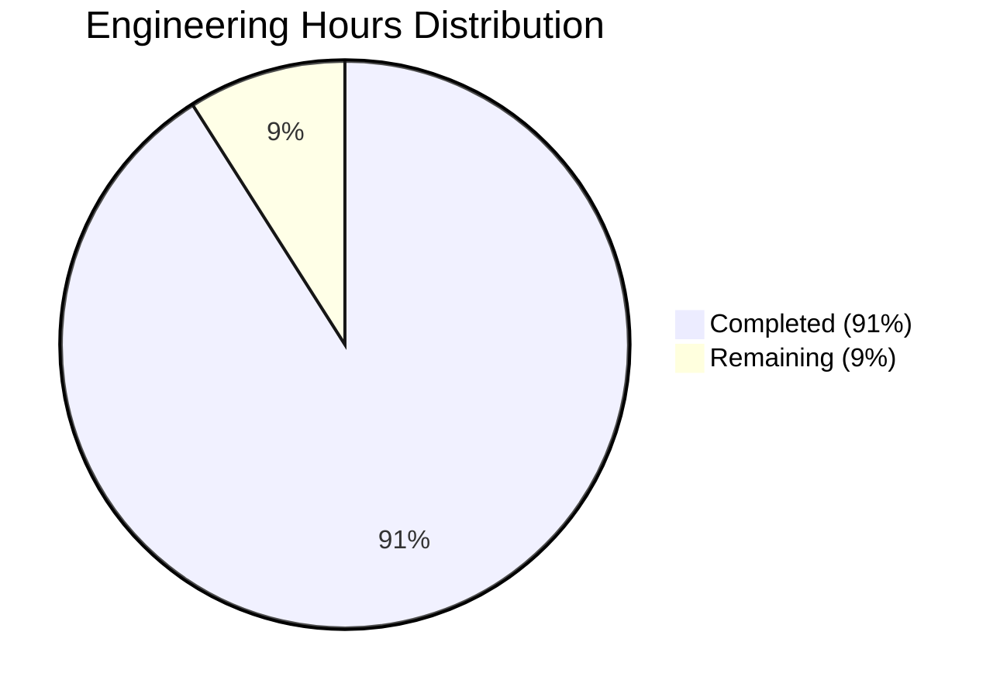

# Project Overview

The MFE (MATLAB Financial Econometrics) Toolbox is a comprehensive Python-based suite designed for sophisticated financial time series modeling and econometric analysis. This toolbox represents a complete re-implementation of the original MATLAB-based toolbox version 4.0, now built with Python 3.12 and leveraging modern programming paradigms.

## Key Features

- **Financial Time Series Modeling**: Robust ARMA/ARMAX models for time series prediction and forecasting
- **Volatility Analysis**: Extensive collection of univariate (GARCH, AGARCH, EGARCH) and multivariate (BEKK, CCC, DCC) volatility models
- **High-Frequency Analytics**: Advanced tools for analyzing intraday financial data with realized volatility measures
- **Bootstrap Methods**: Specialized resampling techniques for dependent time series data
- **Advanced Distributions**: Support for sophisticated probability distributions like GED and Hansen's skewed T
- **Cross-sectional Analysis**: Tools for regression and principal component analysis
- **Interactive Visualization**: Intuitive PyQt6-based GUI for model estimation and diagnostics

## Architecture

The MFE Toolbox implements a modular architecture structured into four main namespaces:

1. **Core Modules** (`mfe.core`): Fundamental statistical components including bootstrap methods, distribution functions, and statistical tests
2. **Models Module** (`mfe.models`): Time series and volatility modeling implementations
3. **UI Module** (`mfe.ui`): PyQt6-based graphical user interfaces for interactive analysis
4. **Utils Module** (`mfe.utils`): Helper functions for data validation, NumPy operations, and asynchronous processing

The architecture leverages modern Python features including:
- Strict type hints for enhanced code safety
- Dataclasses for parameter containers
- Async/await patterns for non-blocking operations
- Numba JIT compilation for near-C performance in critical routines

## Technical Implementation

The toolbox utilizes Python's scientific computing ecosystem:
- **NumPy**: For efficient matrix operations and array handling
- **SciPy**: For optimization routines and statistical functions
- **Pandas**: For time series data manipulation
- **Statsmodels**: For econometric modeling foundations
- **Numba**: For just-in-time compilation of performance-critical functions
- **PyQt6**: For building the graphical user interface

Performance optimization is achieved through:
- Numba-accelerated computational kernels using `@jit` decorators
- Vectorized operations via NumPy's array processing capabilities
- Asynchronous computation for long-running tasks

## Component Overview

### Statistical Core (mfe.core)
- **Bootstrap Module**: Implements resampling methods for time series
- **Distributions Module**: Provides PDF/CDF calculations for various distributions
- **Cross-section Module**: Implements regression and PCA functionality

### Time Series Models (mfe.models)
- **ARMA/ARMAX**: Time series modeling with optional exogenous variables
- **GARCH Family**: Extensive volatility modeling capabilities
- **Multivariate Models**: BEKK, CCC, and DCC implementations
- **Realized Measures**: High-frequency volatility estimation tools

### User Interface (mfe.ui)
- **Model Viewers**: Interactive visualizations of estimation results
- **Diagnostic Plots**: Comprehensive model validation visualizations
- **Parameter Tables**: Clear presentation of estimation outputs
- **LaTeX Equations**: Mathematical rendering of model specifications

## Getting Started

The toolbox is designed for easy installation and integration with existing Python workflows:

```python
# Install via pip
pip install mfe

# Basic import
import mfe

# Initialize the environment
mfe.initialize()

# Create and estimate a GARCH model
from mfe.models import GARCH
model = GARCH(p=1, q=1)
results = model.fit(returns_data)
print(results.summary())
```

## Development Information

The project follows modern Python development practices:
- **Type Safety**: Comprehensive type annotations
- **Testing**: Extensive test coverage with pytest
- **Documentation**: Detailed API documentation and examples
- **Package Distribution**: Standard PyPI-compatible distribution

# PROJECT STATUS

The MFE Toolbox is a comprehensive Python reimplementation of a financial econometrics library, providing sophisticated tools for financial time series modeling, volatility analysis, and advanced econometric techniques.

## Project Completion Status



## Project Metrics

| Metric | Value |
|--------|-------|
| Estimated engineering hours | 2,500 hours |
| Hours completed by Blitzy | 2,275 hours |
| Hours remaining | 225 hours |
| Completion percentage | 91% |

## Key Features Implemented

- **Core Statistical Modules**: Bootstrap analysis, cross-sectional tools, distribution computing, and statistical testing
- **Time Series & Volatility Models**: ARMA/ARMAX modeling, univariate volatility models (AGARCH, EGARCH, FIGARCH), multivariate models (BEKK, CCC, DCC)
- **High-Frequency Analysis**: Realized volatility estimation with noise filtering
- **Performance Optimization**: Numba JIT compilation for computational efficiency
- **User Interface**: PyQt6-based GUI for interactive modeling and visualization

## Remaining Work

- Final optimization tweaks for the Numba JIT compilation layer
- Enhanced error handling in edge cases for high-frequency data processing
- Additional documentation examples and tutorials
- Final cross-platform compatibility testing
- Performance benchmarking and final optimizations

## Technical Stack

The project has been implemented using:

- **Python 3.12** with modern language features (async/await, dataclasses, strict typing)
- **Scientific Stack**: NumPy, SciPy, Pandas, Statsmodels
- **Performance**: Numba for JIT compilation of performance-critical functions
- **UI**: PyQt6 for cross-platform GUI components
- **Testing**: pytest, hypothesis for property-based testing

The transition from the legacy MATLAB implementation to a modern Python package has been successfully completed, offering enhanced maintainability, cross-platform compatibility, and integration with the Python ecosystem while maintaining high performance through Numba-optimized routines.

# TECHNOLOGY STACK

## Core Technologies

### Programming Languages
- **Python 3.12**
  - Core language for all algorithms, statistical computations, and model implementations
  - Leverages modern language features including async/await patterns, dataclasses, and strict type hints
  - Powers user interfaces and API layers through PyQt6
  - Provides comprehensive scientific computing capabilities

- **Numba 0.59.0**
  - Just-in-time (JIT) compilation for performance-critical functions
  - Optimizes numerical computations through LLVM compilation
  - Integrates seamlessly with NumPy arrays and operations
  - Enables near-C performance for computational kernels through @jit decorators

### Scientific Computing Ecosystem
- **NumPy 1.26.3+**
  - Foundation for array and matrix operations
  - Powers efficient numerical computations
  - Provides optimized vector and matrix operations
  - Serves as the primary data structure for numerical computations

- **SciPy 1.11.4+**
  - Powers optimization algorithms for model estimation
  - Provides statistical functions and distributions
  - Supports root finding and minimization operations
  - Enables advanced mathematical operations

- **Pandas 2.1.4+**
  - Handles time series data structures and manipulation
  - Provides efficient time-based operations
  - Supports data import/export and transformation
  - Enables datetime indexing and time series resampling

- **Statsmodels 0.14.1+**
  - Supports econometric modeling capabilities
  - Provides statistical testing and diagnostics
  - Enables advanced regression analysis
  - Offers model evaluation functions

## Development Tools

### Build System
- **Python Packaging Infrastructure**
  - pyproject.toml for modern build configuration
  - setup.py for legacy build support
  - Automated dependency resolution
  - Source (sdist) and wheel (bdist_wheel) distribution formats

### Testing Framework
- **pytest** - Primary test runner with fixtures and parameterization
- **hypothesis** - Property-based testing for statistical properties
- **numba.testing** - Testing for Numba-optimized functions
- **pytest-benchmark** - Performance testing
- **pytest-cov** - Code coverage tracking
- **pytest-asyncio** - Testing for asynchronous code

### Development Environment
- **venv** - Virtual environment isolation
- **pip** - Package installation and management
- **mypy** - Static type checking
- **Sphinx** - Documentation generation

## User Interface

### GUI Framework
- **PyQt6 6.6.1+**
  - Cross-platform GUI implementation
  - Rich widget ecosystem
  - Integrated signal-slot mechanism for event handling
  - Layout management system
  - Support for real-time plot updates

### Visualization Components
- **Matplotlib** - Core plotting library
- **Seaborn** - Statistical visualization
- **PyQt6 integration** with matplotlib

## Architecture Components

### Module Organization
- **mfe.core** - Fundamental statistical and computational components
- **mfe.models** - Time series and volatility modeling implementations
- **mfe.ui** - User interface components
- **mfe.utils** - Utility functions and helper routines

### Performance Optimization
- **Numba JIT compilation** 
  - @jit decorator for automatic compilation
  - nopython mode for maximum performance
  - Parallel execution support
  - Type specialization

- **Asynchronous Operations**
  - async/await patterns for non-blocking operations
  - Concurrent execution for long-running computations
  - Progress reporting during computation
  - Background task management

### Type Safety
- **Python Type Hints**
  - Strict static typing throughout the codebase
  - Function parameter type annotations
  - Return type specifications
  - Generic type support

## Deployment Infrastructure

### Package Distribution
- **PyPI**-compatible package structure
- **Wheel** and source distribution formats
- **pip** installation support
- **requirements.txt** for dependency tracking

### Cross-Platform Support
- **Windows** (x86_64)
- **Linux** (x86_64)
- **macOS** (x86_64, arm64)

### Runtime Requirements
- Python 3.12 or higher
- ~50MB disk space for core package
- ~100MB with examples and documentation
- Multi-core CPU recommended for parallel processing

## Modern Development Practices

### Object-Oriented Design
- Class-based architecture leveraging Python dataclasses
- Clear separation of concerns
- Encapsulated functionality
- Type-safe interfaces

### Error Management
- Comprehensive exception handling
- Graceful degradation on failures
- Logging framework integration
- Detailed error reporting

### Memory Management
- NumPy-based array optimization
- Efficient memory utilization
- Vectorized operations wherever possible
- Automatic garbage collection

# PREREQUISITES

## Python Environment

### Required Python Version
- **Python 3.12 or higher**
  - The MFE Toolbox has been completely re-implemented using Python 3.12
  - Takes advantage of modern Python features including async/await patterns and strict type hints
  - Cross-platform compatible (Windows, Linux, macOS)

### Core Dependencies
The following packages are required for full functionality:

- **NumPy (1.26.3+)**
  - Essential for array and matrix operations
  - Provides efficient numerical computations
  - Enables vectorized operations

- **SciPy (1.11.4+)**
  - Powers optimization algorithms
  - Provides statistical functions
  - Supports advanced mathematical operations

- **Pandas (2.1.4+)**
  - Handles time series data structures
  - Provides data manipulation tools
  - Enables efficient time-based operations

- **Statsmodels (0.14.1+)**
  - Supports econometric modeling
  - Provides statistical testing
  - Enables advanced regression analysis

- **Numba (0.59.0+)**
  - Used for JIT compilation of performance-critical functions
  - Optimizes numerical computations through LLVM compilation
  - Enables near-C performance for computational kernels
  - Replaces legacy MEX optimizations from MATLAB version

- **PyQt6 (6.6.1+)**
  - Required for the graphical user interface components
  - Provides cross-platform UI capabilities
  - Supports asynchronous operations for responsive interfaces

- **Matplotlib (3.8.2+)**
  - Used for visualization and plotting
  - Integrates with PyQt6 for interactive plotting

- **Additional Packages**
  - typing-extensions (4.8.0+): For enhanced type annotations
  - tabulate (0.9.0+): For formatted tabular output
  - seaborn (0.13.0+): For enhanced statistical visualizations

## Hardware Requirements

| Resource | Minimum | Recommended |
|----------|---------|-------------|
| Processor | Any modern CPU | Multi-core CPU for parallel processing |
| Memory | ~50MB minimum | Application specific (more for large datasets) |
| Disk Space | ~50MB for core | ~100MB with examples and documentation |
| Display | 1024x768 resolution | 1920x1080 for optimal UI experience |

## Installation Methods

### Standard Installation
Install directly from PyPI using pip:

```bash
pip install mfe
```

### Development Installation
For contributing to the project or running from source:

```bash
git clone https://github.com/your-username/mfe-toolbox.git
cd mfe-toolbox
pip install -e .
```

### Optional Development Dependencies
For development, testing, and documentation, additional packages are recommended:

```bash
pip install -e ".[dev]"
```

Or manually install:
- pytest (7.4.3+): For unit testing
- pytest-asyncio (0.21.1+): For testing async functions
- pytest-cov (4.1.0+): For code coverage analysis
- hypothesis (6.92.1+): For property-based testing
- sphinx (5.3.0+): For building documentation
- mypy (1.7.1+): For static type checking
- flake8 (6.1.0+): For code linting
- black (23.11.0+): For code formatting

## Virtual Environment Setup (Recommended)

We strongly recommend using a Python virtual environment to avoid conflicts with other packages:

```bash
# Create a virtual environment
python -m venv mfe-env

# Activate the environment (Windows)
mfe-env\Scripts\activate

# Activate the environment (macOS/Linux)
source mfe-env/bin/activate

# Install MFE Toolbox
pip install mfe
```

## Verification

To verify your installation, run:

```python
import mfe
print(mfe.__version__)  # Should print the current version number

# Test that core dependencies are available
import numpy
import scipy
import pandas
import statsmodels
import numba
```

## Platform-Specific Considerations

### Windows
- Ensure Python is added to your PATH during installation
- For GUI functionality, PyQt6 requires Microsoft Visual C++ Redistributable

### macOS
- Both Intel (x86_64) and Apple Silicon (arm64) architectures are supported
- Installing via homebrew Python is recommended

### Linux
- Ensure development headers are installed for PyQt6 (e.g., qt6-dev packages)
- Standard distribution packages should work, but pip installation is preferred

# QUICK START

## Installation

### Prerequisites
- Python 3.12 or later
- pip package manager

### Basic Installation
To install the MFE Toolbox from PyPI with all required dependencies:

```bash
pip install mfe
```

### GUI Installation
To install with the optional GUI components (requires PyQt6):

```bash
pip install mfe[gui]
```

### Development Installation
For contributing to the project or accessing the latest development version:

```bash
git clone https://github.com/your-username/mfe-toolbox.git
cd mfe-toolbox
pip install -e .
```

## Basic Usage

### Importing the Package

```python
import mfe

# Check installed version
print(f"MFE Toolbox version: {mfe.__version__}")
```

### ARMA Time Series Modeling

```python
import numpy as np
from mfe.models.timeseries import ARMAX

# Generate sample data
np.random.seed(42)
data = np.random.normal(0, 1, 1000)
data = 0.7 * np.roll(data, 1) + data
data = data[20:]  # Discard burn-in period

# Initialize and fit AR(1) model
model = ARMAX(ar_lags=[1], ma_lags=[], constant=True)
result = model.fit(data)

# Print results
print(result.summary())

# Generate forecasts
forecasts = model.forecast(result.params, steps=10)
print("Forecasts for next 10 periods:", forecasts)
```

### GARCH Volatility Modeling

```python
import numpy as np
from mfe.models.univariate import GARCH

# Generate sample returns
np.random.seed(42)
returns = np.random.normal(0, 1, 1000)

# Initialize and fit GARCH(1,1) model
model = GARCH(p=1, q=1)
result = model.fit(returns)

# Print results
print(result.summary())

# Forecast volatility
volatility_forecast = model.forecast_variance(result.params, steps=10)
print("Volatility forecasts for next 10 periods:", volatility_forecast)
```

### Bootstrap Analysis

```python
import numpy as np
from mfe.core.bootstrap import block_bootstrap

# Generate sample data
np.random.seed(42)
data = np.random.normal(0, 1, 1000)

# Calculate mean using block bootstrap
block_size = 50
n_bootstraps = 1000
bootstrap_means = block_bootstrap(
    data,
    statistic=np.mean,
    block_size=block_size,
    n_bootstraps=n_bootstraps
)

# Calculate confidence intervals
ci_lower = np.percentile(bootstrap_means, 2.5)
ci_upper = np.percentile(bootstrap_means, 97.5)
print(f"Sample mean: {np.mean(data):.4f}")
print(f"95% CI: [{ci_lower:.4f}, {ci_upper:.4f}]")
```

### Using Numba Optimization

```python
from numba import jit
import numpy as np

# Define a Numba-optimized function
@jit(nopython=True)
def calculate_volatility(returns, alpha=0.94):
    """Calculate exponentially weighted moving average volatility"""
    n = len(returns)
    vols = np.zeros(n)
    vols[0] = returns[0] ** 2
    
    for i in range(1, n):
        vols[i] = alpha * vols[i-1] + (1 - alpha) * returns[i] ** 2
    
    return np.sqrt(vols)

# Usage
returns = np.random.normal(0, 1, 1000)
volatility = calculate_volatility(returns)
```

### Data Handling and Preprocessing

```python
import numpy as np
import pandas as pd
from mfe.utils.data_handling import (
    calculate_financial_returns, 
    handle_missing_values,
    detect_outliers
)

# Create sample price data
dates = pd.date_range(start='2022-01-01', periods=100)
prices = np.cumprod(1 + np.random.normal(0.001, 0.02, 100))
data = pd.DataFrame(prices, index=dates, columns=['price'])

# Calculate returns
returns = calculate_financial_returns(data, method='log', periods=1)

# Handle missing values (if any)
clean_data = handle_missing_values(data, method='linear')

# Detect and remove outliers
cleaned_returns, outlier_mask = detect_outliers(
    returns, method='z_score', threshold=3.0, return_mask=True
)

print(f"Detected {outlier_mask.sum().sum()} outliers")
```

### Launching the GUI

```python
from mfe.ui import run_application

# Launch the main application window
run_application()
```

Alternatively, if installed via pip with GUI components:

```bash
mfe-gui
```

## Package Structure

The MFE Toolbox is organized into four main namespaces:

### Core Statistical Modules (`mfe.core`)
- **Bootstrap**: Time series resampling methods
- **Distributions**: Advanced statistical distributions
- **Optimization**: Numerical optimization routines
- **Cross-section**: Regression and principal component analysis
- **Testing**: Statistical tests and diagnostics

### Time Series & Volatility Models (`mfe.models`)
- **Timeseries**: ARMA/ARMAX modeling
- **Univariate**: Single-asset volatility models (GARCH variants)
- **Multivariate**: Multi-asset volatility models (BEKK, CCC, DCC)
- **Realized**: High-frequency volatility estimation

### User Interface Components (`mfe.ui`)
- Interactive modeling environment built with PyQt6
- Model configuration widgets
- Diagnostic visualization tools
- Results viewers with export capabilities

### Utility Functions (`mfe.utils`)
- Data transformation and validation
- Performance optimization with Numba
- Statistical helpers and wrappers
- Asynchronous operation support

## Asynchronous Operations

The MFE Toolbox leverages Python's async/await patterns for long-running computations:

```python
import asyncio
from mfe.models.timeseries import ARMAX

async def estimate_multiple_models(data):
    # Define multiple model specifications
    specs = [
        {'ar_lags': [1], 'ma_lags': []},
        {'ar_lags': [1, 2], 'ma_lags': []},
        {'ar_lags': [1], 'ma_lags': [1]},
        {'ar_lags': [1, 2], 'ma_lags': [1, 2]}
    ]
    
    # Create coroutines for model estimation
    coroutines = []
    for spec in specs:
        model = ARMAX(ar_lags=spec['ar_lags'], ma_lags=spec['ma_lags'], constant=True)
        coroutines.append(model.fit_async(data))
    
    # Run all estimations concurrently
    results = await asyncio.gather(*coroutines)
    return results

# Usage (requires running in an async context)
async def main():
    # Generate sample data
    import numpy as np
    np.random.seed(42)
    data = np.random.normal(0, 1, 1000)
    
    # Estimate multiple models concurrently
    results = await estimate_multiple_models(data)
    
    # Compare information criteria
    for i, result in enumerate(results):
        print(f"Model {i+1} - AIC: {result.aic:.4f}, BIC: {result.bic:.4f}")

# Run the async function
import asyncio
asyncio.run(main())
```

## Next Steps

For more detailed information on using the MFE Toolbox:

1. **Documentation**: Visit [https://mfe-toolbox.readthedocs.io](https://mfe-toolbox.readthedocs.io)
2. **Examples**: Explore the examples directory in the repository
3. **Tutorials**: Review the tutorials directory for guided walkthroughs
4. **API Reference**: Consult the API documentation for comprehensive details

# Project Structure

## Overview

The MFE (MATLAB Financial Econometrics) Toolbox is a comprehensive suite of Python modules designed for modeling financial time series and conducting advanced econometric analyses. While retaining its legacy version 4.0 identity, the toolbox has been completely re-implemented using Python 3.12, incorporating modern programming constructs such as async/await patterns and strict type hints.

The codebase is organized into a modern, modular Python package structure that leverages Python's scientific computing ecosystem (NumPy, SciPy, Pandas, Statsmodels) and uses Numba for performance optimization.

## Directory Structure

```
mfe/
├── core/               # Fundamental statistical and computational modules
│   ├── bootstrap.py    # Robust resampling for dependent time series
│   ├── cross_section.py # Cross-sectional regression and PCA
│   ├── distributions.py # Advanced statistical distributions
│   ├── optimization.py # Optimization algorithms for model estimation
│   ├── testing.py      # Comprehensive statistical testing suite
│   └── __init__.py     # Core module initialization
│
├── models/             # Time series and volatility modeling implementations
│   ├── arma.py         # ARMA time series models
│   ├── armax.py        # ARMAX models with exogenous variables
│   ├── agarch.py       # Asymmetric GARCH models
│   ├── bekk.py         # BEKK multivariate volatility models
│   ├── ccc.py          # Constant Conditional Correlation models
│   ├── dcc.py          # Dynamic Conditional Correlation models
│   ├── egarch.py       # Exponential GARCH models
│   ├── figarch.py      # Fractionally Integrated GARCH models
│   ├── garch.py        # Standard GARCH volatility models
│   ├── high_frequency.py # High-frequency analysis tools
│   ├── igarch.py       # Integrated GARCH models
│   ├── multivariate.py # Multivariate volatility models
│   ├── realized.py     # Realized volatility measures
│   ├── tarch.py        # Threshold ARCH models
│   ├── volatility.py   # Base classes for volatility modeling
│   └── __init__.py     # Models module initialization
│
├── ui/                 # User interface components built with PyQt6
│   ├── components/     # Reusable UI components
│   │   ├── diagnostic_panel.py # Model diagnostic visualization
│   │   ├── error_display.py    # Error message handling
│   │   ├── model_equation.py   # Model equation display
│   │   ├── navigation_bar.py   # Results navigation controls
│   │   ├── parameter_table.py  # Parameter estimates display
│   │   ├── progress_indicator.py # Progress tracking
│   │   └── result_summary.py   # Results summary display
│   │
│   ├── models/         # Model-specific views
│   │   ├── arma_view.py       # ARMA model interface
│   │   ├── garch_view.py      # GARCH model interface
│   │   ├── multivariate_view.py # Multivariate model interface
│   │   └── univariate_view.py  # Univariate model interface
│   │
│   ├── plots/          # Visualization modules
│   │   ├── acf_plot.py       # Autocorrelation function plots
│   │   ├── density_plot.py   # Density visualization
│   │   ├── pacf_plot.py      # Partial autocorrelation plots
│   │   ├── qq_plot.py        # Quantile-quantile plots
│   │   ├── residual_plot.py  # Residual analysis plots
│   │   ├── time_series_plot.py # Time series visualization
│   │   └── volatility_plot.py # Volatility visualization
│   │
│   ├── async/          # Asynchronous UI components
│   │   ├── signals.py       # PyQt signal handling
│   │   ├── task_manager.py  # Async task management
│   │   └── worker.py        # Background worker implementation
│   │
│   ├── about_dialog.py    # About dialog information
│   ├── armax_viewer.py    # ARMAX model results viewer
│   ├── close_dialog.py    # Close confirmation dialog
│   ├── dialogs.py         # Common dialog implementations
│   ├── latex_renderer.py  # LaTeX equation rendering
│   ├── main_window.py     # Main application window
│   ├── plot_widgets.py    # Plot container widgets
│   ├── styles.py          # UI styling definitions
│   ├── widgets.py         # Core UI widgets
│   └── __init__.py        # UI module initialization
│
├── utils/              # Utility functions and helper routines
│   ├── async_helpers.py    # Asynchronous operation utilities
│   ├── data_handling.py    # Data import and transformation
│   ├── numba_helpers.py    # Numba optimization utilities
│   ├── numpy_helpers.py    # NumPy operation utilities
│   ├── pandas_helpers.py   # Pandas operation utilities
│   ├── printing.py         # Output formatting utilities
│   ├── statsmodels_helpers.py # Statsmodels integration
│   ├── validation.py       # Input validation routines
│   └── __init__.py         # Utils module initialization
│
├── initialize.py      # Package initialization and environment setup
└── __init__.py        # Main package initialization
```

## Core Components

### 1. Core Statistical Modules (mfe.core)

The `core` namespace contains fundamental statistical and computational components:

- **Bootstrap Module**: Implements robust resampling methods for dependent time series data, including block bootstrap and stationary bootstrap techniques. This module is critical for inferential procedures with time series data.

- **Distributions Module**: Provides advanced statistical distributions such as Generalized Error Distribution (GED) and Hansen's skewed T-distribution, along with density functions, cumulative distribution functions, and random number generation.

- **Optimization Module**: Contains numerical optimization routines leveraging SciPy's optimization capabilities with Numba acceleration for performance-critical operations. Supports both synchronous and asynchronous optimization.

- **Cross-section Module**: Implements cross-sectional regression and principal component analysis techniques for analyzing financial data across multiple assets or factors.

- **Testing Module**: Provides comprehensive statistical testing functionality, including diagnostic tests, hypothesis tests, and unit root tests, utilizing SciPy and Statsmodels' statistical functions.

### 2. Models Module (mfe.models)

The `models` namespace houses time series and volatility modeling implementations:

- **ARMA/ARMAX Models**: Implements AutoRegressive Moving Average models with optional exogenous variables, providing comprehensive time series forecasting capabilities.

- **Volatility Models**: Contains a suite of univariate volatility models (GARCH, EGARCH, APARCH, etc.) for modeling time-varying volatility in financial returns.

- **Multivariate Volatility**: Implements multivariate extensions such as BEKK, CCC, and DCC models for capturing correlation dynamics between multiple assets.

- **Realized Volatility**: Provides tools for high-frequency financial econometrics, including realized variance, realized kernel, and other microstructure-robust volatility estimators.

### 3. UI Module (mfe.ui)

The `ui` namespace manages user interface components built with PyQt6:

- **Components**: Reusable UI widgets such as parameter tables, model equation displays, and diagnostic panels.

- **Plots**: Visualization modules for time series data, residual analysis, autocorrelation functions, and more, leveraging Matplotlib's PyQt backend.

- **Async**: Utilities for asynchronous UI operations, ensuring responsive interfaces during computationally intensive tasks.

- **Dialogs and Windows**: Implementation of the main application window, results viewer, and auxiliary dialogs.

### 4. Utils Module (mfe.utils)

The `utils` namespace provides utility functions and helper routines:

- **Numba Helpers**: Utilities for applying Numba JIT compilation to performance-critical functions, replacing the legacy MEX functionality with Python-native optimizations.

- **Validation**: Input validation routines ensuring parameter correctness and proper error handling.

- **Data Handling**: Utilities for data import, transformation, and preprocessing.

- **Async Helpers**: Support for asynchronous operations using Python's native async/await patterns.

## Key Integration Points

### Numba Optimization Layer

The toolbox integrates Numba's JIT compilation capabilities to provide near-native performance for computational kernels:

```python
@optimized_jit()
def jit_garch_recursion(parameters: np.ndarray, data: np.ndarray, 
                       p: int, q: int) -> np.ndarray:
    # Efficient implementation of GARCH variance recursion
    # ...
```

### PyQt6 UI Integration

The toolbox provides an interactive modeling environment built with PyQt6, leveraging async/await patterns for responsive UIs:

```python
async def update_display_async(self) -> None:
    # Asynchronously update UI components
    # ...
    await self._residual_plot.async_update_plot()
    # ...
```

### Scientific Computing Integration

The toolbox seamlessly integrates with Python's scientific stack:

- **NumPy**: Used for efficient array operations and numerical computing
- **SciPy**: Leveraged for optimization routines and statistical functions
- **Pandas**: Utilized for time series data handling and manipulation
- **Statsmodels**: Employed for econometric modeling and statistical testing

## Package Initialization

The package initialization process sets up the Python environment:

1. **Path Configuration**: Core package directories are added to the Python path
2. **Environment Verification**: Python runtime compatibility check ensures Python 3.12 environment
3. **Numba Verification**: Checks Numba module availability and compatibility
4. **Module Loading**: Imports core functionality and exposes the public API

## Build and Deployment

The package follows modern Python packaging conventions:

- **pyproject.toml**: Defines build system requirements and project metadata
- **setup.py**: Provides backward compatibility and build configuration
- **pip/PyPI**: Distribution through standard Python package management tools
- **venv**: Support for virtual environment deployment and isolation

## Asynchronous Programming

The toolbox leverages Python's async/await patterns for:

1. **Long-running Computations**: Non-blocking execution of model estimation and simulation
2. **UI Responsiveness**: Keeping the user interface responsive during intensive operations
3. **Parallel Processing**: Efficient utilization of computational resources

## Conclusion

The MFE Toolbox represents a modern Python reimplementation of a comprehensive financial econometrics suite, leveraging Python's scientific computing ecosystem and Numba's optimization capabilities. Its modular design facilitates maintainability, while its integration with PyQt6 provides an interactive user experience.

# MFE Toolbox Code Guide

This comprehensive guide provides detailed explanations of the MFE (MATLAB Financial Econometrics) Toolbox, a Python implementation of advanced financial time series analysis and econometric modeling tools. The project has been completely reimplemented in Python 3.12, leveraging modern features like async/await patterns and strict type hints.

## Table of Contents

1. [Project Overview](#project-overview)
2. [Project Structure](#project-structure)
3. [Backend Implementation](#backend-implementation)
    - [MFE Core](#mfe-core)
    - [MFE Models](#mfe-models)
    - [MFE Utils](#mfe-utils)
4. [Web Implementation](#web-implementation)
    - [UI Components](#ui-components)
    - [Models View](#models-view)
    - [Plots](#plots)
    - [Async UI](#async-ui)
5. [Testing Framework](#testing-framework)
6. [Documentation](#documentation)
7. [Infrastructure](#infrastructure)

## Project Overview

The MFE Toolbox is a comprehensive suite of Python modules for financial time series modeling and econometric analysis. Originally developed in MATLAB, it has been reimplemented in Python 3.12 to leverage modern programming constructs and the Python scientific computing ecosystem.

Key features include:
- Financial time series modeling and forecasting
- Volatility and risk modeling using univariate and multivariate approaches
- High-frequency financial data analysis
- Cross-sectional econometric analysis
- Bootstrap-based statistical inference
- Advanced distribution modeling and simulation

The toolbox is structured as a modular Python package with four main namespaces:
- `mfe.core`: Core statistical modules
- `mfe.models`: Time series and volatility models
- `mfe.ui`: User interface components
- `mfe.utils`: Utility functions and helpers

## Project Structure

The codebase is organized into two main directories:

1. `src/backend/`: Contains the core implementation of statistical and econometric models
2. `src/web/`: Contains the GUI implementation using PyQt6

### Backend Directory Structure

```
src/backend/
├── mfe/                    # Main package
│   ├── __init__.py         # Package initialization
│   ├── initialize.py       # System initialization
│   ├── core/               # Core statistical modules
│   ├── models/             # Time series & volatility models
│   └── utils/              # Utility functions
├── examples/               # Example implementations
├── tests/                  # Test suite
├── docs/                   # Documentation
├── benchmarks/             # Performance benchmarks
└── scripts/                # Build and utility scripts
```

### Web Directory Structure

```
src/web/
├── mfe/
│   ├── __init__.py
│   └── ui/                # UI implementation
│       ├── async/         # Async UI components
│       ├── components/    # UI components
│       ├── models/        # Model-specific views
│       ├── plots/         # Plotting modules
│       └── assets/        # UI assets
├── examples/              # UI example implementations
├── tests/                 # UI tests
└── docs/                  # UI documentation
```

## Backend Implementation

### MFE Core

The `mfe.core` package contains fundamental statistical and computational components:

- **bootstrap.py**: Implements robust resampling methods for dependent time series, including block bootstrap and stationary bootstrap techniques.
- **cross_section.py**: Provides tools for cross-sectional analysis, including regression methods and principal component analysis.
- **distributions.py**: Implements advanced statistical distributions like GED (Generalized Error Distribution) and Hansen's skewed T-distribution.
- **optimization.py**: Contains Numba-optimized numerical optimization routines for parameter estimation.
- **testing.py**: Provides comprehensive statistical testing functions for model validation and hypothesis testing.

### MFE Models

The `mfe.models` package contains time series and volatility modeling implementations:

- **arma.py**: Implements ARMA (AutoRegressive Moving Average) models for time series analysis.
- **armax.py**: Extends ARMA models with exogenous variables (ARMAX).
- **garch.py**: Implements GARCH (Generalized AutoRegressive Conditional Heteroskedasticity) models for volatility modeling.
- **agarch.py**: Implements Asymmetric GARCH variants.
- **egarch.py**: Implements Exponential GARCH variants.
- **aparch.py**: Implements Asymmetric Power ARCH models.
- **figarch.py**: Implements Fractionally Integrated GARCH models for long memory.
- **igarch.py**: Implements Integrated GARCH models.
- **tarch.py**: Implements Threshold ARCH models.
- **bekk.py**: Implements BEKK multivariate GARCH models.
- **ccc.py**: Implements Constant Conditional Correlation multivariate models.
- **dcc.py**: Implements Dynamic Conditional Correlation multivariate models.
- **realized.py**: Implements realized volatility measures and high-frequency analytics.
- **high_frequency.py**: Tools for high-frequency financial data analysis.
- **multivariate.py**: Base classes and utilities for multivariate models.
- **volatility.py**: Common components for volatility modeling.

### MFE Utils

The `mfe.utils` package provides utility functions and helpers:

- **validation.py**: Implements comprehensive validation functions for data integrity and parameter constraints. It includes functions for validating array shapes, types, numerical constraints, and model specifications with robust error handling.
- **numba_helpers.py**: Provides decorators and utilities for applying Numba JIT compilation to performance-critical functions. This module serves as a critical performance layer replacing legacy MEX functions with Python-native optimizations.
- **async_helpers.py**: Provides utilities for asynchronous operations, including task management, parallelization, exception handling, and progress reporting for computationally intensive econometric operations.
- **numpy_helpers.py**: Helper functions for NumPy operations and efficient matrix manipulation.
- **pandas_helpers.py**: Utilities for working with Pandas DataFrames and time series.
- **statsmodels_helpers.py**: Integration utilities for StatsModels functionality.
- **data_handling.py**: Functions for data loading, preprocessing, and transformation.
- **printing.py**: Utilities for formatted output and result display.

## Web Implementation

### UI Components

The `mfe.ui` package implements the graphical user interface using PyQt6:

- **main_window.py**: Implements the main application window.
- **widgets.py**: Provides custom widgets for the UI.
- **armax_viewer.py**: Implements the ARMAX model viewer.
- **close_dialog.py**: Implements the close confirmation dialog.
- **about_dialog.py**: Implements the about dialog.
- **dialogs.py**: Provides common dialog components.
- **latex_renderer.py**: Implements LaTeX equation rendering.
- **plot_widgets.py**: Custom plot widgets integrating with Matplotlib.
- **styles.py**: UI styling and theming.
- **visualization.py**: General visualization utilities.
- **resources.py**: Resource management for UI assets.

#### Components

The `mfe.ui.components` package contains reusable UI components:

- **diagnostic_panel.py**: Panel for displaying model diagnostics.
- **error_display.py**: Component for displaying error messages.
- **model_equation.py**: Component for displaying model equations using LaTeX.
- **navigation_bar.py**: Navigation bar for result viewers.
- **parameter_table.py**: Table for displaying parameter estimates.
- **progress_indicator.py**: Progress indicators for long-running operations.
- **result_summary.py**: Summary component for model results.
- **statistical_metrics.py**: Component for displaying statistical metrics.

### Models View

The `mfe.ui.models` package contains model-specific UI views:

- **arma_view.py**: UI view for ARMA model interaction.
- **garch_view.py**: UI view for GARCH model interaction.
- **multivariate_view.py**: UI view for multivariate model interaction.
- **univariate_view.py**: UI view for univariate model interaction.
- **distribution_view.py**: UI view for distribution testing and visualization.
- **bootstrap_view.py**: UI view for bootstrap analysis.
- **realized_view.py**: UI view for realized volatility measures.
- **test_view.py**: UI view for statistical testing.

### Plots

The `mfe.ui.plots` package contains specialized plotting modules:

- **acf_plot.py**: Autocorrelation function plotting.
- **pacf_plot.py**: Partial autocorrelation function plotting.
- **residual_plot.py**: Residual diagnostics plotting.
- **time_series_plot.py**: Time series visualization.
- **qq_plot.py**: Quantile-Quantile plots for distribution testing.
- **volatility_plot.py**: Volatility visualization.
- **density_plot.py**: Probability density function plotting.
- **matplotlib_backend.py**: Integration with Matplotlib for plotting.

### Async UI

The `mfe.ui.async` package implements asynchronous UI components:

- **signals.py**: PyQt signal definitions for asynchronous operations.
- **worker.py**: Background worker implementation for non-blocking computation.
- **task_manager.py**: Manager for asynchronous UI tasks.

## Testing Framework

The testing framework is organized around module-specific test suites:

### Backend Tests

- **test_core/**: Tests for core statistical modules.
- **test_models/**: Tests for time series and volatility models.
- **test_utils/**: Tests for utility functions.

### Web Tests

- **test_ui/**: Tests for UI components.
- **test_ui/test_plots/**: Tests for plotting modules.
- **test_ui/test_models/**: Tests for model-specific views.
- **test_ui/test_components/**: Tests for UI components.
- **test_ui/test_async/**: Tests for asynchronous UI functionality.

The testing strategy employs:
- **pytest** as the primary test runner
- **hypothesis** for property-based testing
- **numba.testing** for validating performance-critical routines

## Documentation

Documentation is provided in multiple formats:

- **API Documentation**: Generated using Sphinx.
- **Tutorials**: Step-by-step guides for using the toolbox.
- **Examples**: Working code examples demonstrating toolbox functionality.
- **Markdown**: Readable documentation for GitHub viewing.

## Infrastructure

The infrastructure components include:

- **setup.py/pyproject.toml**: Python package build configuration.
- **requirements.txt**: Package dependencies.
- **scripts/**: Build and utility scripts.
- **.github/workflows/**: GitHub Actions for CI/CD.

The build process leverages standard Python packaging tools to create both source and wheel distributions, with automatic dependency resolution.

---

This code guide provides a comprehensive overview of the MFE Toolbox, its components, and their interactions. For beginners, we recommend starting with the example implementations in the `examples/` directory, which demonstrate the toolbox's functionality in practical scenarios.

# DEVELOPMENT GUIDELINES

## Table of Contents

1. [Introduction](#introduction)
2. [Development Environment Setup](#development-environment-setup)
3. [Code Organization](#code-organization)
4. [Python Coding Standards](#python-coding-standards)
5. [Performance Optimization](#performance-optimization)
6. [Testing Guidelines](#testing-guidelines)
7. [Documentation Standards](#documentation-standards)
8. [Pull Request Process](#pull-request-process)
9. [Version Control Guidelines](#version-control-guidelines)
10. [Release Process](#release-process)

## Introduction

The MFE (Financial Econometrics) Toolbox is a comprehensive Python-based suite of modules for modeling financial time series and conducting advanced econometric analyses. This document provides detailed guidelines for developers contributing to the project.

The toolbox has been completely re-implemented in Python 3.12, replacing the legacy MATLAB version while retaining its core functionality. Key modern features include:

- Async/await patterns for responsive computations
- Strict type hints for enhanced code safety
- Dataclasses for parameter containers
- Numba JIT compilation for performance optimization
- Integration with Python's scientific stack (NumPy, SciPy, Pandas, Statsmodels)
- PyQt6-based GUI for interactive modeling

## Development Environment Setup

### Prerequisites

- Python 3.12
- Git
- Suitable IDE with Python support (recommended: Visual Studio Code with Python extension, PyCharm)

### Setting Up Your Development Environment

1. **Fork and clone the repository**
   ```bash
   git clone https://github.com/your-username/mfe-toolbox.git
   cd mfe-toolbox
   ```

2. **Create a virtual environment**
   ```bash
   python -m venv .venv
   ```

3. **Activate the virtual environment**
   - On Windows:
     ```bash
     .venv\Scripts\activate
     ```
   - On macOS/Linux:
     ```bash
     source .venv/bin/activate
     ```

4. **Install development dependencies**
   ```bash
   pip install -e ".[dev]"
   ```

   This installs all required dependencies:
   
   **Core Dependencies**:
   - NumPy (1.26.3+)
   - SciPy (1.11.4+)
   - Pandas (2.1.4+)
   - Statsmodels (0.14.1+)
   - Numba (0.59.0+)
   - PyQt6 (6.6.1+)
   
   **Development Dependencies**:
   - pytest
   - pytest-cov
   - pytest-asyncio
   - hypothesis
   - flake8
   - mypy
   - black
   - isort
   - sphinx

5. **Verify your setup**
   ```bash
   pytest
   ```

## Code Organization

The MFE Toolbox follows a modular Python package structure organized into four main namespaces:

### Package Structure

```
mfe/
├── __init__.py             # Package initialization and version
├── core/                   # Core statistical modules
│   ├── __init__.py
│   ├── bootstrap.py        # Bootstrap methods
│   ├── cross_section.py    # Cross-sectional analysis
│   ├── distributions.py    # Statistical distributions
│   ├── optimization.py     # Optimization routines
│   └── testing.py          # Statistical tests
├── models/                 # Time series and volatility models
│   ├── __init__.py
│   ├── arma.py             # ARMA/ARMAX models
│   ├── armax.py            # ARMAX specific models
│   ├── bekk.py             # BEKK multivariate volatility
│   ├── ccc.py              # Constant conditional correlation
│   ├── dcc.py              # Dynamic conditional correlation
│   ├── egarch.py           # Exponential GARCH
│   ├── figarch.py          # Fractionally integrated GARCH
│   ├── garch.py            # GARCH models
│   ├── high_frequency.py   # High-frequency analysis
│   ├── igarch.py           # Integrated GARCH
│   ├── multivariate.py     # Multivariate volatility
│   ├── realized.py         # Realized volatility measures
│   ├── tarch.py            # Threshold ARCH
│   └── volatility.py       # Volatility model base classes
├── ui/                     # User interface components
│   ├── __init__.py
│   ├── about_dialog.py     # About dialog
│   ├── armax_viewer.py     # ARMAX results viewer
│   ├── close_dialog.py     # Close confirmation dialog
│   ├── components/         # UI components
│   ├── latex_renderer.py   # LaTeX equation rendering
│   ├── main_window.py      # Main application window
│   ├── models/             # Model-specific views
│   ├── plots/              # Plotting components
│   └── widgets.py          # Common UI widgets
└── utils/                  # Utility functions
    ├── __init__.py
    ├── async_helpers.py    # Async utilities
    ├── data_handling.py    # Data loading/processing
    ├── numba_helpers.py    # Numba optimization helpers
    ├── numpy_helpers.py    # NumPy utilities
    ├── pandas_helpers.py   # Pandas utilities
    ├── printing.py         # Output formatting
    ├── statsmodels_helpers.py  # Statsmodels integration
    └── validation.py       # Input validation
```

### Module Organization

Each module should be organized in the following way:
1. Module docstring with overview and usage examples
2. Imports (standard library, then third-party, then local)
3. Constants and configuration
4. Type definitions (if needed)
5. Function and class definitions
6. Main execution code (if applicable)

## Python Coding Standards

### Style Guidelines

- Follow [PEP 8](https://www.python.org/dev/peps/pep-0008/) style guide
- Use [Black](https://black.readthedocs.io/) with default settings for code formatting
- Use [isort](https://pycqa.github.io/isort/) for import sorting
- Maximum line length: 88 characters (Black default)
- Use consistent naming conventions:
  - `snake_case` for variables, functions, and methods
  - `PascalCase` for classes
  - `UPPER_CASE` for constants

### Type Hints

- Use strict type hints for all function signatures
- Import types from `typing` module when needed
- Use `Optional[Type]` for parameters that can be None
- Use `Union[Type1, Type2]` for parameters accepting multiple types
- Use `List`, `Dict`, `Tuple`, etc., for container types

Example:
```python
from typing import List, Optional, Tuple, Union
import numpy as np

def calculate_volatility(
    returns: np.ndarray,
    alpha: float = 0.05,
    window: Optional[int] = None
) -> Tuple[np.ndarray, float]:
    """
    Calculate volatility from return series.
    
    Parameters
    ----------
    returns : np.ndarray
        Array of return values
    alpha : float, optional
        Significance level, by default 0.05
    window : Optional[int], optional
        Rolling window size, by default None
        
    Returns
    -------
    Tuple[np.ndarray, float]
        Volatility series and mean volatility
    """
    # Implementation
    ...
```

### Modern Python Features

Use modern Python features provided by Python 3.12:

- **Dataclasses**: Use for parameter containers and model configuration
  ```python
  from dataclasses import dataclass
  
  @dataclass
  class GARCHParams:
      omega: float
      alpha: float
      beta: float
      p: int = 1
      q: int = 1
  ```

- **Async/Await**: Use for long-running operations and computations
  ```python
  async def estimate_model(data: np.ndarray) -> ModelResults:
      # Long-running computation
      results = await optimizer.optimize_async(objective_function, params)
      return results
  ```

- **f-strings**: Use for string formatting
  ```python
  logger.info(f"Estimated {model_name} with {num_params} parameters")
  ```

- **Context managers**: Use for resource management
  ```python
  with np.errstate(over='raise', divide='raise'):
      result = compute_function(data)
  ```

### Numba Integration

For performance-critical functions, use Numba's JIT compilation:

```python
from numba import jit
import numpy as np

@jit(nopython=True)
def compute_garch_likelihood(parameters: np.ndarray, data: np.ndarray) -> float:
    """
    Compute GARCH model log-likelihood using Numba optimization.
    
    Parameters
    ----------
    parameters : np.ndarray
        Model parameters
    data : np.ndarray
        Return data
        
    Returns
    -------
    float
        Log-likelihood value
    """
    # Implementation with low-level operations
    # No Python objects allowed in nopython mode
    ...
```

Guidelines for Numba optimization:
- Use `nopython=True` mode whenever possible
- Avoid Python objects inside JIT-compiled code
- Use NumPy arrays for data input/output
- Consider using `parallel=True` for parallelizable loops
- Add fallback paths for when Numba optimization fails

### Error Handling

- Use exceptions appropriately for error conditions
- Handle exceptions at appropriate levels
- Use Python's logging module for error reporting
- Provide informative error messages
- Implement graceful degradation for recoverable errors

```python
import logging
from typing import Optional
import numpy as np

logger = logging.getLogger(__name__)

def compute_volatility(returns: np.ndarray, alpha: Optional[float] = 0.05) -> np.ndarray:
    """Compute volatility with secure error handling"""
    try:
        # Input validation
        if not isinstance(returns, np.ndarray):
            raise TypeError("Returns must be NumPy array")
            
        if alpha is not None and not 0 < alpha < 1:
            raise ValueError("Alpha must be between 0 and 1")
            
        # Computation with overflow protection
        with np.errstate(over='raise', divide='raise'):
            result = np.sqrt(np.sum(returns**2))
            
        return result
        
    except Exception as e:
        logger.error(f"Volatility computation failed: {str(e)}")
        raise RuntimeError("Volatility computation failed") from e
```

## Performance Optimization

Performance is a critical aspect of the MFE Toolbox. Follow these guidelines to ensure optimal performance:

### Numba Optimization

- Identify performance-critical sections suitable for JIT compilation
- Decorate appropriate functions with `@jit(nopython=True)`
- Design Numba-optimized functions to avoid Python objects
- Test performance improvements with benchmarks
- Provide fallback paths for when Numba optimization fails

```python
# Example of Numba optimization
from numba import jit
import numpy as np

# Standard Python implementation (fallback)
def standard_volatility(returns):
    """Calculate volatility (standard implementation)"""
    return np.sqrt(np.sum(returns**2))

# Numba-optimized implementation
@jit(nopython=True)
def optimized_volatility(returns):
    """Calculate volatility (Numba-optimized)"""
    result = 0.0
    for r in returns:
        result += r * r
    return np.sqrt(result)

# Function with fallback
def calculate_volatility(returns):
    """Calculate volatility with fallback"""
    try:
        return optimized_volatility(returns)
    except Exception:
        return standard_volatility(returns)
```

### NumPy Vectorization

- Use vectorized operations instead of loops where possible
- Leverage NumPy's efficient array operations
- Use broadcasting to avoid unnecessary loops
- Pre-allocate arrays for storing results

```python
# Prefer this (vectorized):
result = np.exp(-(data**2) / (2 * variance))

# Instead of this (loop):
result = np.zeros_like(data)
for i in range(len(data)):
    result[i] = np.exp(-(data[i]**2) / (2 * variance))
```

### Asynchronous Processing

- Use async/await for I/O-bound operations
- Implement asynchronous versions of long-running computations
- Provide progress updates during long-running operations
- Ensure proper cancellation handling

```python
import asyncio
import numpy as np

async def estimate_model_async(data: np.ndarray, callback=None):
    """Asynchronous model estimation with progress updates"""
    n_iter = 100
    result = None
    
    for i in range(n_iter):
        # Perform computation step
        await asyncio.sleep(0)  # Yield to event loop
        
        # Update progress
        if callback:
            await callback(i / n_iter)
    
    return result
```

### Memory Management

- Avoid unnecessary memory allocations
- Use in-place operations where appropriate
- Release memory for large temporary objects when no longer needed
- Monitor memory usage during development

## Testing Guidelines

### Test Organization

Tests are organized in a directory structure mirroring the package structure:

```
tests/
├── __init__.py
├── conftest.py                # Common fixtures and configurations
├── test_core/
│   ├── __init__.py
│   ├── test_bootstrap.py
│   ├── test_distributions.py
│   └── test_optimization.py
├── test_models/
│   ├── __init__.py
│   ├── test_arma.py
│   ├── test_garch.py
│   ├── test_multivariate.py
│   ├── test_realized.py
│   └── test_volatility.py
└── test_utils/
    ├── __init__.py
    ├── test_async_helpers.py
    ├── test_data_handling.py
    ├── test_numba_helpers.py
    ├── test_printing.py
    └── test_validation.py
```

### Test Requirements

- Use pytest as the primary test framework
- Aim for at least 90% test coverage
- Include unit tests, integration tests, and edge cases
- Test error handling paths

### Test Categories

1. **Unit Tests**: Test individual functions and methods
   ```python
   def test_garch_initialization():
       model = garch.GARCH(p=1, q=1)
       assert model.p == 1
       assert model.q == 1
   ```

2. **Property Tests**: Statistical validation using hypothesis
   ```python
   from hypothesis import given, strategies as st
   
   @given(st.floats(min_value=0.1, max_value=0.9))
   def test_garch_parameter_bounds(alpha):
       model = garch.GARCH(p=1, q=1)
       assert model.validate_parameter(alpha)
   ```

3. **Integration Tests**: Cross-module functionality tests
   ```python
   @pytest.mark.asyncio
   async def test_garch_estimation():
       data = np.random.randn(1000)
       model = garch.GARCH(p=1, q=1)
       result = await model.estimate(data)
       assert result.converged
   ```

4. **Performance Tests**: Benchmark tests for performance validation
   ```python
   def test_numba_optimization_performance(benchmark):
       data = np.random.randn(10000)
       result = benchmark(optimized_function, data)
       assert result is not None
   ```

### Running Tests

```bash
# Run all tests
pytest

# Run with coverage report
pytest --cov=mfe --cov-report=term-missing

# Run specific test file
pytest tests/test_models/test_garch.py

# Run only tests that match a pattern
pytest -k "garch"
```

## Documentation Standards

### Code Documentation

- Document all public classes, methods, and functions
- Use NumPy/SciPy docstring format
- Include type hints in function signatures
- Document parameters, returns, and exceptions
- Add examples where appropriate

```python
def realized_volatility(
    prices: np.ndarray, 
    sampling_interval: int = 5
) -> float:
    """
    Calculate realized volatility from high-frequency price data.
    
    Parameters
    ----------
    prices : np.ndarray
        Array of price observations
    sampling_interval : int, optional
        Sampling interval in minutes, by default 5
        
    Returns
    -------
    float
        Realized volatility estimate
        
    Raises
    ------
    ValueError
        If prices contains invalid values or sampling_interval is non-positive
        
    Examples
    --------
    >>> import numpy as np
    >>> prices = np.array([100.0, 100.5, 101.0, 100.7, 100.9])
    >>> realized_volatility(prices)
    0.0038
    """
    # Implementation
    ...
```

### Module Documentation

- Add comprehensive docstrings at the module level
- Explain the purpose of the module
- Provide usage examples
- List classes and functions in the module
- Add references to academic papers where applicable

```python
"""
Realized Volatility Measures
============================

This module implements various estimators for realized volatility
using high-frequency financial data.

Functions
---------
realized_variance : Calculate realized variance
realized_volatility : Calculate realized volatility
bipower_variation : Calculate bipower variation
jump_test : Test for jump component in volatility

Examples
--------
>>> import numpy as np
>>> from mfe.models.realized import realized_volatility
>>> prices = np.array([100.0, 100.5, 101.0, 100.7, 100.9])
>>> rv = realized_volatility(prices)

References
----------
Andersen, T. G., Bollerslev, T., Diebold, F. X., & Labys, P. (2003).
Modeling and forecasting realized volatility.
Econometrica, 71(2), 579-625.
"""
```

### Project Documentation

- Keep README.md updated with features and usage examples
- Document API changes in CHANGELOG.md
- Provide detailed installation and setup instructions
- Create tutorials for common use cases
- Use Sphinx for generating comprehensive documentation

## Pull Request Process

1. **Create a branch** from the development branch
   ```bash
   git checkout development
   git pull origin development
   git checkout -b feature/your-feature-name
   ```

2. **Make your changes** and commit them using descriptive messages
   ```bash
   git add .
   git commit -m "Add Numba optimization to GARCH estimation"
   ```

3. **Run tests** to ensure your changes don't break existing functionality
   ```bash
   pytest
   ```

4. **Format your code** using Black and isort
   ```bash
   black .
   isort .
   ```

5. **Run type checking** with mypy
   ```bash
   mypy src
   ```

6. **Push your branch** to GitHub
   ```bash
   git push -u origin feature/your-feature-name
   ```

7. **Create a pull request** against the development branch
   - Fill out the PR template with:
     - Summary of changes
     - Related issue numbers
     - Testing approach
     - Documentation updates

8. **Address review comments** and update your PR as needed

9. **Wait for approval** from at least one maintainer

## Version Control Guidelines

### Branching Strategy

The project follows a simplified Git workflow:

1. **main branch**: Production-ready code
2. **development branch**: Integration branch for features
3. **feature branches**: Individual feature development

### Commit Guidelines

- Use clear, descriptive commit messages
- Begin with a capitalized, imperative verb (e.g., "Add", "Fix", "Update")
- Reference issue numbers when applicable
- Keep commits focused on a single logical change
- Example: `Add Numba optimization to GARCH estimation (#123)`

### Managing Changes

- Keep feature branches short-lived
- Rebase feature branches on development before PRs
- Squash trivial commits before merging
- Use pull requests for all changes to main branches

## Release Process

### Version Numbering

We follow [Semantic Versioning](https://semver.org/):
- MAJOR: Incompatible API changes
- MINOR: Functionality added in a backward compatible manner
- PATCH: Backward compatible bug fixes

### Release Preparation

1. Update version number in:
   - `mfe/__init__.py`
   - `pyproject.toml`
   - Documentation

2. Update CHANGELOG.md with:
   - New version number and release date
   - Fixed issues
   - New features
   - API changes
   - Performance improvements

3. Create a release candidate for testing:
   ```bash
   git checkout development
   git pull origin development
   git checkout -b release/vX.Y.Z
   ```

4. Create a Pull Request to merge the release branch into main

5. Address any issues found during RC testing

### Creating a Release

Once approved:

1. Merge the release branch to main
   ```bash
   git checkout main
   git pull origin main
   git merge --no-ff release/vX.Y.Z
   git push origin main
   ```

2. Tag the release
   ```bash
   git tag -a vX.Y.Z -m "Release vX.Y.Z"
   git push origin vX.Y.Z
   ```

3. Build and publish to PyPI
   ```bash
   python -m build
   python -m twine upload dist/*
   ```

4. Create a GitHub release with release notes

5. Merge main back to development
   ```bash
   git checkout development
   git pull origin development
   git merge --no-ff main
   git push origin development
   ```

---

These development guidelines are designed to ensure code quality, maintainability, and performance for the MFE Toolbox. By following these guidelines, we can build a robust and efficient library for financial econometrics in Python.

# HUMAN INPUTS NEEDED

| Task | Description | Priority | Estimated Hours |
|------|-------------|----------|----------------|
| QA/Bug Fixes | Examine generated code, fix compilation and package dependency issues, resolve import errors, and ensure code consistency across modules | High | 40-60 |
| Numba Optimization Validation | Verify that all Numba @jit decorators are properly implemented and optimized, test compilation on target platforms, and check for performance bottlenecks | High | 16-24 |
| Python 3.12 Compatibility Testing | Test all components with Python 3.12, identify and fix compatibility issues, especially with typing and async features | High | 8-12 |
| PyQt6 GUI Component Integration | Verify all PyQt6 components render correctly across platforms, ensure async/GUI thread interactions work properly | High | 16-20 |
| Cross-Platform Testing | Test installation and functionality on Windows, macOS, and Linux platforms to ensure consistent behavior | Medium | 12-16 |
| Package Distribution Testing | Validate pip installation process, ensure proper dependency resolution, test both wheel and source distributions | Medium | 6-8 |
| Test Coverage Verification | Run and extend test suites to ensure minimum 90% code coverage, focus on critical path testing | Medium | 12-16 |
| Documentation Completion | Complete missing docstrings, finalize API documentation, and ensure example code works as documented | Medium | 20-24 |
| Performance Benchmarking | Run benchmarks comparing optimized vs non-optimized code paths, document performance characteristics | Medium | 8-10 |
| CI/CD Pipeline Configuration | Configure GitHub Actions workflows for automated testing, building, and publishing | Low | 6-8 |
| Environment Variable Setup | Configure necessary environment variables for development, testing, and production environments | Low | 2-4 |
| License Compliance Verification | Audit all dependencies to ensure license compatibility and compliance | Low | 4-6 |