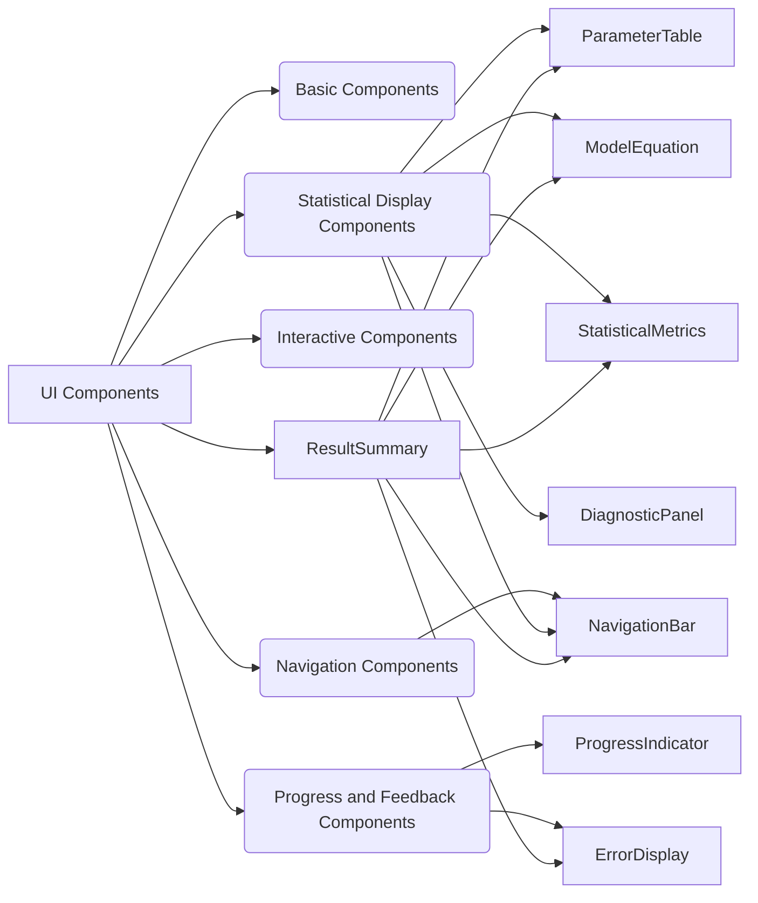

# UI Components in MFE Toolbox

Comprehensive documentation of the PyQt6-based UI components available in the MFE Toolbox, providing details about usage, properties, methods, and integration patterns for each component to support custom UI development and extension.

## Introduction

Introduction to the MFE Toolbox UI component system, including the PyQt6 <!-- PyQt6 6.6.1+ --> foundation, component architecture, and organization patterns.

The MFE Toolbox UI is built using PyQt6 <!-- PyQt6 6.6.1+ -->, a powerful and flexible framework for creating cross-platform desktop applications. The UI is designed with a modular component-based architecture, allowing for easy customization and extension.

## Component Overview

High-level overview of all available components, their categories, and relationships, with a component dependency diagram.

The UI components are organized into several categories:

- **Basic Components**: Fundamental UI building blocks like labels, buttons, and input fields.
- **Statistical Display Components**: Components for presenting statistical results, metrics, and parameters.
- **Interactive Components**: Components providing user interaction capabilities.
- **Navigation Components**: Components for managing multi-view interfaces.
- **Progress and Feedback Components**: Components for displaying operation progress and status.



## Basic Components

Documentation of fundamental UI building blocks used throughout the MFE Toolbox interface.

These components are the basic building blocks for creating user interfaces. They include:

- `QLabel` <!-- PyQt6 6.6.1+ -->: For displaying text or images.
- `QPushButton` <!-- PyQt6 6.6.1+ -->: For triggering actions.
- `QLineEdit` <!-- PyQt6 6.6.1+ -->: For text input.
- `QComboBox` <!-- PyQt6 6.6.1+ -->: For selecting options from a dropdown list.
- `QCheckBox` <!-- PyQt6 6.6.1+ -->: For toggling options.

## Statistical Display Components

Components designed for presenting statistical results, metrics, and parameters from econometric models.

These components are specialized for displaying statistical information. They include:

- [ParameterTable](#parametertable): Interactive table for displaying model parameter estimates with statistical metrics
- [ModelEquation](#modelequation): PyQt6 widget for displaying mathematical model equations using LaTeX rendering
- [StatisticalMetrics](#statisticalmetrics): Panel for displaying model fit statistics and information criteria
- [DiagnosticPanel](#diagnosticpanel): Comprehensive panel for diagnostic testing and model validation

## Interactive Components

Components providing user interaction capabilities including input forms, configuration panels, and control interfaces.

These components allow users to interact with the application. They include:

- `QLineEdit` <!-- PyQt6 6.6.1+ -->: For text input.
- `QComboBox` <!-- PyQt6 6.6.1+ -->: For selecting options from a dropdown list.
- `QPushButton` <!-- PyQt6 6.6.1+ -->: For triggering actions.
- `QCheckBox` <!-- PyQt6 6.6.1+ -->: For toggling options.

## Navigation Components

Components for managing multi-view interfaces, page navigation, and workflow progression.

These components help users navigate through different parts of the application. They include:

- [NavigationBar](#navigationbar): Navigation control for multi-page interfaces with page indicators

## Progress and Feedback Components

Components for displaying operation progress, status updates, and error notifications during model processing.

These components provide feedback to the user about the progress of long-running operations. They include:

- [ProgressIndicator](#progressindicator): Progress bar component for displaying task completion status
- [ErrorDisplay](#errordisplay): User-friendly error message display with formatted exception details

## Component Documentation

### ParameterTable

Interactive table for displaying model parameter estimates with statistical metrics

**Properties:**

- Interactive table displaying parameter names, estimates, standard errors, t-statistics, and p-values
- Significance highlighting for p-values below threshold
- Export capability for saving results to CSV
- Dynamic updates via PyQt signals when model parameters change
- Customizable formatting options for statistical values

**API Reference:**

- **Constructor:** `ParameterTable(parent=None)`
- **Methods:**
    - `set_parameter_data(parameter_data) - Update table with new parameter estimates`
    - `export_table() - Export current table data to CSV file`
    - `toggle_highlight() - Toggle highlighting of significant parameters`
    - `set_significance_level(level) - Set significance threshold for highlighting`
- **Signals:**
    - Responds to `parameters_updated` signal from `ModelSignals`

**Usage Example:**

```python
# Create parameter table widget
table = ParameterTable()

# Update with parameter data
table.set_parameter_data({
    'AR(1)': {'estimate': 0.75, 'std_error': 0.05, 't_stat': 15.0, 'p_value': 0.001},
    'MA(1)': {'estimate': -0.25, 'std_error': 0.06, 't_stat': -4.2, 'p_value': 0.02},
    'const': {'estimate': 0.01, 'std_error': 0.005, 't_stat': 2.0, 'p_value': 0.04}
})
```

### ModelEquation

PyQt6 widget for displaying mathematical model equations using LaTeX rendering

**Properties:**

- Renders mathematical model equations in properly formatted LaTeX
- Supports ARMA/ARMAX model equation display with parameters
- Supports GARCH family model equation display
- Allows custom equation rendering through raw LaTeX input
- Adjustable font size and parameter display options
- Updates equation dynamically when parameters change

**API Reference:**

- **Constructor:** `ModelEquation(parent=None, font_size=12, display_params=True)`
- **Methods:**
    - `set_arma_equation(p, q, include_constant=True, k_exog=None, params=None) - Display ARMA/ARMAX equation`
    - `set_garch_equation(p, q, params=None) - Display GARCH variance equation`
    - `set_custom_equation(latex_string, params=None) - Display custom equation`
    - `update_parameters(params) - Update parameter values in displayed equation`
    - `set_font_size(size) - Change display font size`
    - `clear_equation() - Remove currently displayed equation`
- **Signals:**
    - None

**Usage Example:**

```python
# Create equation display widget
equation = ModelEquation(font_size=14)

# Display ARMA(1,1) equation
equation.set_arma_equation(
    p=1, q=1, include_constant=True,
    params={'phi_1': 0.75, 'theta_1': -0.25, 'c': 0.01}
)
```

### ErrorDisplay

User-friendly error message display with formatted exception details

**Properties:**

- Formats Python exceptions into user-readable messages
- Categorizes errors by type (data, configuration, runtime, etc.)
- Provides context-specific help text for common errors
- Supports expandable technical details for debugging
- Customizable appearance with severity-based styling

**API Reference:**

- **Constructor:** `ErrorDisplay(parent=None)`
- **Methods:**
    - `display_error(exception, context=None) - Display formatted error from exception`
    - `display_message(message, category='general', severity='error') - Display custom error message`
    - `clear() - Remove currently displayed error`
- **Signals:**
    - None

**Usage Example:**

```python
# Create error display widget
error_display = ErrorDisplay()

# Display exception
try:
    result = complex_operation()
except Exception as e:
    error_display.display_error(e, context='model estimation')
```

### ProgressIndicator

Progress bar component for displaying task completion status

**Properties:**

- Visual indicator of operation progress with percentage display
- Support for determinate (known steps) and indeterminate (unknown duration) progress
- Customizable appearance including colors and text formatting
- Optional cancelation button for long-running operations
- Status text display for operation description

**API Reference:**

- **Constructor:** `ProgressIndicator(parent=None, cancelable=False)`
- **Methods:**
    - `set_progress(value) - Update progress bar value (0-100)`
    - `set_status(text) - Update status message text`
    - `start_indeterminate() - Start indeterminate progress animation`
    - `stop_indeterminate() - Stop indeterminate progress animation`
    - `reset() - Reset progress to initial state`
- **Signals:**
    - `canceled - Emitted when cancel button is clicked`

**Usage Example:**

```python
# Create progress indicator
progress = ProgressIndicator(cancelable=True)

# Update during operation
for i in range(100):
    # Perform operation step
    progress.set_progress(i)
    progress.set_status(f'Processing step {i+1}/100')
```

### StatisticalMetrics

Panel for displaying model fit statistics and information criteria

**Properties:**

- Organized display of key model fitness metrics
- Includes log-likelihood, AIC, BIC, and other information criteria
- Support for residual statistics and distribution metrics
- Formatted for readability with proper statistical notation
- Updates dynamically when model results change

**API Reference:**

- **Constructor:** `StatisticalMetrics(parent=None)`
- **Methods:**
    - `set_metrics(metrics_dict) - Update displayed metrics with new values`
    - `clear() - Remove all currently displayed metrics`
    - `highlight_metric(metric_name) - Visually emphasize a specific metric`
- **Signals:**
    - None

**Usage Example:**

```python
# Create metrics panel
metrics = StatisticalMetrics()

# Update with model results
metrics.set_metrics({
    'log_likelihood': -245.67,
    'aic': -2.34,
    'bic': -2.28,
    'residual_variance': 0.025
})
```

### DiagnosticPanel

Comprehensive panel for diagnostic testing and model validation

**Properties:**

- Tabbed interface for multiple diagnostic test results
- Supports residual tests, specification tests, and stability tests
- Displays test statistics with critical values and p-values
- Color coding for test pass/fail indications
- Expandable sections for detailed test explanations

**API Reference:**

- **Constructor:** `DiagnosticPanel(parent=None)`
- **Methods:**
    - `add_test_result(name, result, p_value, null_hypothesis, interpretation=None) - Add diagnostic test result`
    - `clear_tests() - Remove all test results`
    - `set_model_type(model_type) - Configure panel for specific model type`
- **Signals:**
    - None

**Usage Example:**

```python
# Create diagnostic panel
diagnostics = DiagnosticPanel()

# Add test results
diagnostics.add_test_result(
    name='Jarque-Bera',
    result=5.67,
    p_value=0.03,
    null_hypothesis='Residuals are normally distributed',
    interpretation='Residuals may not be normally distributed (p < 0.05)'
)
```

### NavigationBar

Navigation control for multi-page interfaces with page indicators

**Properties:**

- Next/Previous buttons for sequential navigation
- Page indicators showing current position and total pages
- Optional page labels for context-specific navigation
- Customizable appearance and button styling
- Support for enabling/disabling navigation based on workflow state

**API Reference:**

- **Constructor:** `NavigationBar(parent=None, total_pages=1)`
- **Methods:**
    - `set_current_page(page) - Update current page indicator`
    - `set_total_pages(total) - Set total number of pages`
    - `set_page_labels(labels) - Set custom labels for pages`
    - `enable_navigation(enabled) - Enable or disable navigation controls`
- **Signals:**
    - `page_changed(new_page) - Emitted when page navigation occurs`

**Usage Example:**

```python
# Create navigation bar
nav = NavigationBar(total_pages=3)
nav.set_page_labels(['Summary', 'Diagnostics', 'Forecasts'])

# Connect to page change handler
nav.page_changed.connect(on_page_changed)
```

### ResultSummary

Consolidated view of model estimation results with collapsible sections

**Properties:**

- Combined display of model specification, parameters, and statistics
- Collapsible sections for different result categories
- Integrated equation display with parameter values
- Summary statistics and model information
- Export functionality for complete results

**API Reference:**

- **Constructor:** `ResultSummary(parent=None)`
- **Methods:**
    - `set_model_results(results) - Update with new model estimation results`
    - `expand_all() - Expand all result sections`
    - `collapse_all() - Collapse all result sections`
    - `export_results(filename) - Export results to file`
- **Signals:**
    - None

**Usage Example:**

```python
# Create result summary
summary = ResultSummary()

# Update with model results
summary.set_model_results(model_results)

# Export results
summary.export_results('arma_model_results.txt')
```

## Integration Examples

Usage examples showing how to combine components to create complete UI workflows for econometric modeling tasks.

### Signal-Slot Connections

PyQt6 signal-slot connection pattern for handling updates between components

```python
# Connect model signals to UI components
model_signals = ModelSignals()
parameter_table = ParameterTable()
model_signals.parameters_updated.connect(parameter_table._handle_parameters_updated)
```

### Component Composition

Combining multiple components into composite widgets for complex interfaces

```python
# Create results panel with composed components
class ResultsPanel(QWidget):
    def __init__(self, parent=None):
        super().__init__(parent)
        self.layout = QVBoxLayout()
        self.equation = ModelEquation()
        self.parameters = ParameterTable()
        self.metrics = StatisticalMetrics()
        
        self.layout.addWidget(self.equation)
        self.layout.addWidget(self.parameters)
        self.layout.addWidget(self.metrics)
        self.setLayout(self.layout)
```

### Async Task Integration

Connecting async tasks with progress indicators and result handling

```python
# Set up async task with progress tracking
task_manager = TaskManager()
progress = ProgressIndicator(cancelable=True)

# Connect signals
progress.canceled.connect(task_manager.cancel_current)
task_manager.progress_updated.connect(progress.set_progress)
task_manager.task_completed.connect(handle_results)
```

### Error Handling Chain

Propagating and displaying errors through component hierarchy

```python
# Set up error handling chain
error_display = ErrorDisplay()

# In a model view component
def estimate_model(self):
    try:
        result = self.model.estimate(self.data)
        self.update_results(result)
    except Exception as e:
        self.error_display.display_error(e, context='Model Estimation')
```

## Custom Component Development

Guidelines for extending the component system with custom PyQt6 widgets that integrate with the MFE Toolbox architecture.

### Topics

- Creating custom derived components
- Styling components with Qt stylesheets
- Integrating components with the signal system
- Best practices for component design
- Testing custom components

### Example

```python
# Creating a custom component
class CustomMetricsPanel(StatisticalMetrics):
    def __init__(self, parent=None):
        super().__init__(parent)
        self.add_custom_section()
    
    def add_custom_section(self):
        # Add customized metrics section
        self.custom_section = QGroupBox('Custom Metrics')
        # Add custom widgets and behavior
        
    def set_custom_metric(self, name, value):
        # Custom functionality
        pass